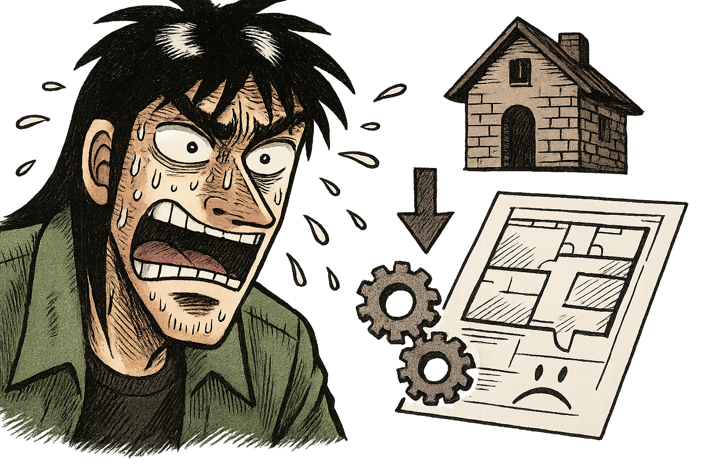
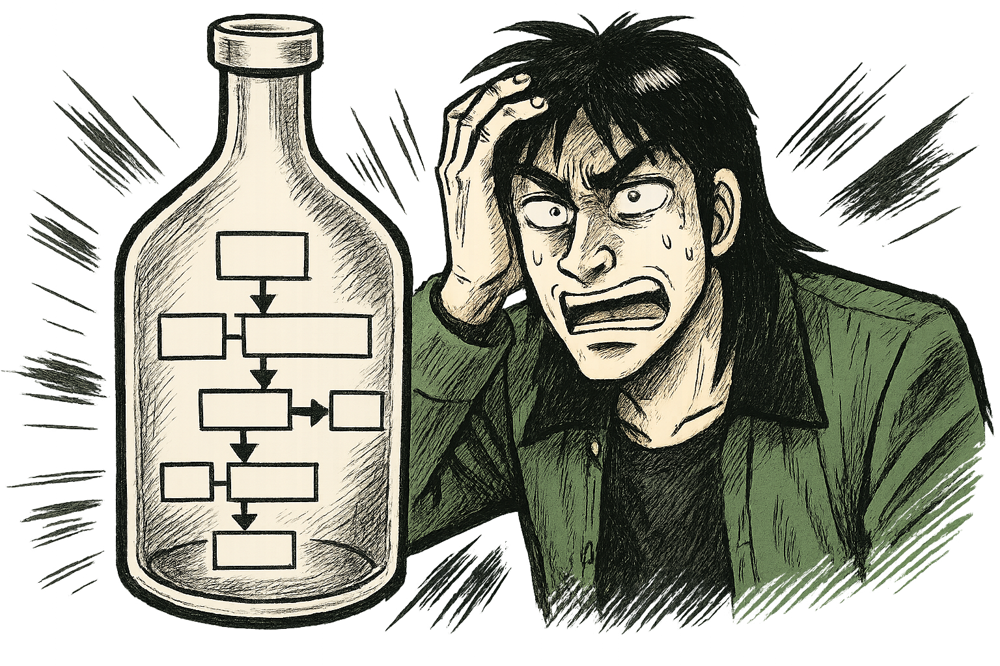

# 『勝つプロマネは「人間力」で決まる』

## 10 年で 50 件超の修羅場をくぐり抜けた PM が贈る実践バイブル

## はじめに：教科書じゃ教えてくれない、PM の「リアル」な話

「よし、プロジェクトマネージャー（PM）になるぞ！」
そう意気込んで、分厚い参考書を開いてみたものの、「ROI」「KPI」「WBS」「クリティカルパス」…なんだか小難しいカタカナや専門用語のオンパレードに、早々に心が折れそうになった経験はないだろうか？

何を隠そう、私自身がそうだった。

だが、心配はいらない。本書は、そんな小難しい理論やフレームワークの話をするつもりは毛頭ない。

私は 20 代後半から 10 年以上、主にシステム開発の現場で PM として飯を食ってきた。担当したプロジェクトは、数百万の小規模なものから億近い大規模案件まで、少なくとも 50 件は下らない。自動車、小売、医療、教育、公共…と分野も多岐にわたり、多い時には 5 つものプロジェクトを同時に回すなんていう、今思えば無茶苦茶な時期もあった。もちろん、対峙する顧客も様々で、本当に色々な考え方ややり方に触れてきた。

そんな数々の修羅場をくぐり抜ける中で、痛感したことがある。
それは、**教科書に載っている立派なマネジメント技法の多くは、実際のプロジェクト現場では驚くほど効果が薄い**ということだ。少なくとも、それらは上司や顧客を納得させるための「お飾り」や「資料作り」の道具として使われる場面がほとんどだった。

じゃあ、PM として本当に注力すべきこと、プロジェクトを成功に導くための「本質」とは一体何なのか？

この本では、私が 10 年以上の PM 経験を通して掴み取った、 **「現場で本当に役立つノウハウ」** だけを、出し惜しみなく語り尽くすつもりだ。誰でもすぐに実践できて、それでいて現実のプロジェクトで高い効果を発揮するものだけを、徹底的に凝縮した。

正直に言おう。PM という仕事は、**技術なんてほとんど通用しない**。
もちろん、担当する分野の基本的な知識は必要だ。だが、それ以上に PM に求められる能力、それは **「人間力」** ――つまり **「人間としての総合力」** だと私は考えている。

この本で語るノウハウは、一見すると「そんなの当たり前じゃないか」と感じるものも多いかもしれない。しかし、読み進めていくうちに、その一つひとつが PM に求められる「人間力」に直結していることに気づくはずだ。

私はもともとエンジニア出身で、主にシステム開発プロジェクトにおける PM 経験がベースになっている。しかし、ここで語る内容は、技術的な詳細ではなく、もっと普遍的で本質的なものに絞り込んでいるつもりだ。だから、他業種の PM の方や、これから PM を目指すすべての若手にとって、きっと応用が効く内容だと信じている。幸いなことに、私が PM として担当したプロジェクトのほとんどは、目標としていた営業利益率 17%以上という基準をクリアすることができた。これは、この「人間力」を軸にしたアプローチが間違っていなかった証左だと考えている。

今まさに PM にチャレンジしようとしている君へ。
あるいは、すでに PM として歩み始めているけれど、どこかで行き詰まりを感じている君へ。

この本が、君の武器となり、迷いを打ち破るための一助となれたら、これほど嬉しいことはない。

さあ、分厚い教科書は一旦脇に置いて、リアルな PM の世界へ、一緒に飛び込もうじゃないか。

 
 
 

## 目次

**はじめに：教科書じゃ教えてくれない、PM の「リアル」な話**

---

**第 1 章：PM の覚悟――すべての責任は、君が背負う**

- なぜ「責任感」がプロジェクト成否の分かれ目なのか？
- 「責任」＝「成長の機会」と「正当な報酬」
- 私の「ボーナス満額」約束：リスクを取るからリターンがある
- まとめ

**第 2 章：プロジェクトの成否は「上流」で決まる**

- コードを書く前に勝負はついている：要件定義・設計の圧倒的重要性
- 下流で炎上？ それ、ほとんど手遅れです
- 上流のミスは「取り返しがつかない」と心得る
- まとめ

**第 3 章：要件定義――顧客の「本当の目的」を掘り起こせ**

- PM 最初の仕事：「なぜ、このプロジェクトをやるのか？」をとことん問う
- 「すべて」を言語化する努力を怠るな
- 知識不足は言い訳にならない：「考えること」から逃げるな
- 顧客に 100%理解・合意してもらうための「翻訳力」
- まとめ

**第 4 章：見積もり――ビジネスとして成功するための生命線**

- 見積もりには必ず「リスク」を織り込め
- 見積もりは「現場のプロ」に聞け
- 使える武器はすべて使え：AI も活用する
- アジャイル時代の見積もり：フィードバック対応も忘れずに
- 見積もりの「条件」を明確にせよ
- 【ぶっちゃけ話】最強の見積もりは「顧客予算」にあり
- まとめ

**第 5 章：課題解決――PM の仕事は「ボトルネック潰し」だ**

- PM の仕事の 9 割は「ボトルネック解消」と心得よ
- 課題管理：ボールは誰？ステータスは？ 常に「見える化」せよ
- 発生した課題は PM の責任：「仕組み」で再発を防げ
- その課題解決は正しいか？ PM が最終判断の責任を負う
- まとめ

**第 6 章：対人関係術 ①――顧客を「同志」に変えるコントロール術**

- 目指すは「同志」：仲良くなるのが成功への近道
- 信頼獲得の秘訣：「即レス」と「顧客目線の提案」
- 「お金の話」と「開発の話」は分けるが吉
- 嘘はつくな、信頼は戻らない
- 安易に謝るな、立場は「対等」だと思え

* 期待値コントロール：満足度は序盤で決まる
* 相談には乗る、ただし「テイカー」には気をつけろ
* どうしようもない担当者もいる：距離を置く勇気

- まとめ

**第 7 章：対人関係術 ②――最強チームを作る「信頼」ベースの管理術**

- PM は「信頼できるメンバー」を集めるゲームのプレイヤー
- 新規メンバーの見極め：「信頼できるか？」を早期に判断せよ
- 信頼できるメンバーは「自由に」：マイクロマネジメントは不要
- 「権限移譲」を恐れるな（ただし放置は論外）
- コミュニケーションの「量」と「質」を担保せよ
- PM の最重要資質：「信頼できるか？」の見極め力
- まとめ

**第 8 章：対人関係術 ③――上司を「味方」につける根回し術**

- やりたい仕事は「待つ」な、「取り」にいけ
- 悪い報告ほど「早く」：上司のリソースを最大限活用せよ
- 状況報告は「こまめに」：上司に安心感と当事者意識を与える
- 「できる自分」をアピールせよ：チャンスを引き寄せる種まき
- ムカつく上司ともうまくやれ：その立場には敬意を払う
- まとめ

**第 9 章：PM 流「セルフケア」――心と体を整え、最高のパフォーマンスを**

- 体調管理も PM の重要な仕事の一つ
- 休む姿を見せる：メンバーが休みやすい空気を作る
- 「ストレス」といかに向き合うか：精神力の重要性
- 精神力には個人差がある：PM が向かない人もいることを知る
- まとめ

**第 10 章：最強の武器「コミュニケーション」を磨く**

- 基本は「即レス」、判断は「秒」で
- 「これを言ったら相手はどう思うか？」想像力をフル回転させろ
- 「言語化力」を鍛え抜け：指示・情報共有は明確に
- 失敗報告には「ありがとう」：責めるべきは自分（の作った仕組み）
- 常に明るく、テンション高く
- Good は全体へ、Bad は個別へ：プライドへの配慮
- 自分の「弱さ」を開示する勇気
- 最悪の状況でも「笑って」みせるリーダーシップ
- トラブル発生時：「大丈夫？」と声をかける寄り添う姿勢
- まとめ

**第 11 章：学び続けろ！――変化の時代を生き抜く PM の「情報収集術」**

- PM はチームで一番の「勉強家」であれ
- 学んだことは「発信」し、チームの知恵とせよ
- 「即採用」「即廃止」：トライ＆エラーを恐れるな
- まとめ

**第 12 章：ドキュメントは「AI と共に」作る時代へ**

- 原則 1：必要最小限――多すぎるドキュメントは「悪」である
- 原則 2：一括管理――情報のサイロ化を防げ
- 原則 3：履歴管理――「いつ、誰が、何を」を追跡可能に
- 原則 4：AI レディ――未来の働き方を見据えよ
- 結論：GitHub（または Git）管理が最適解
- まとめ

**第 13 章：PM こそ「AI」を使い倒せ！**

- コードを書くだけじゃない：PM 業務のあらゆる場面で AI は活躍する
- 既存コードの「解像度」を上げる AI
- AI コードレビューは「当たり前」の時代へ
- 議事録作成は、もう AI に任せろ
- 提案資料作成も AI で高速化
- AI は、PM の「人間力」を増幅させる
- まとめ

---

**おわりに：PM は、最高に面白くてやりがいのある仕事だ**

 
 
 

## 第 1 章：PM の覚悟――すべての責任は、君が背負う

プロジェクトマネージャー（PM）という役割について、君はどんなイメージを持っているだろうか？
スケジュールを管理する人？ タスクを割り振る人？ 会議を仕切る人？

どれも間違いではない。だが、PM の本質、その核となる部分を表すには、少し物足りない。
私が考える PM の最も重要な資質、それは **「すべての責任を背負う覚悟」** だ。

 

### なぜ「責任感」がプロジェクト成否の分かれ目なのか？

考えてみてほしい。プロジェクトがうまくいかなかった時、最終的に誰がその責任を問われるだろうか？
メンバー？ 上司？ 顧客？

いや、違う。**最終的な責任は、すべて PM にある**。
これが大原則だ。もし君が PM をやるなら、この覚悟を持たなければならない。逆に言えば、この覚悟がない人間が PM をやっても、プロジェクトは絶対にうまくいかない。

なぜなら、責任を負うからこそ、PM は誰よりもプロジェクトのことを考え、成功のために必死で行動するようになるからだ。
「誰かがやってくれるだろう」「まあ、大丈夫だろう」
そんな甘い考えは、責任という重圧の前では吹き飛んでしまう。

「このプロジェクトを絶対に成功させるんだ」
その強い意志と覚悟が、PM を突き動かす原動力となる。

 

### 「責任」＝「成長の機会」と「正当な報酬」

もちろん、責任を負うということは、厳しい側面ばかりではない。

プロジェクトが成功した時、その功績のほとんどは PM のものとなる。メンバーや関係者の頑張りはもちろん称えられるべきだが、プロジェクト全体を導き、成功というゴールに到達させた最大の功労者は、間違いなく PM だ。

一方で、プロジェクトが失敗すれば、その責任はすべて PM が負うことになる。言い訳は通用しない。「あのメンバーが…」「顧客が…」と言ったところで、誰も聞いてはくれない。失敗の全責任を負う覚悟がなければ、PM は務まらない。

だが、この「責任」こそが、PM を最も成長させる糧となる。そして、その責任に見合った「報酬」を得る権利も、PM にはある。

 

### 私の「ボーナス満額」約束：リスクを取るからリターンがある

少し生々しい話になるが、私自身の経験を話そう。
私が PM を担当する際、必ず上司と一つの約束を交わしていた。それは、 **「担当プロジェクトで目標としていた数字（主に利益）を達成できたら、私のボーナス査定は満額にしてください」** というものだ。

もちろん、これは「失敗したら減額されても文句は言いません」という覚悟の裏返しでもある。幸いなことに、私はこの約束によって、20 代の頃からほぼ満額のボーナス査定を得ることができた。社内評価は通常、他の社員には公開されない。だから、誰かに角を立てることもなく、自分の成果に対する正当な報酬を得ることができたのだ。

これは、単なる自慢話ではない。
**「責任を負うからこそ、それに見合ったリターンを要求する権利がある」** ということを、君に伝えたかったのだ。リスクを取る覚悟があるからこそ、成功した時の果実も大きくなる。

PM とは、そういう仕事だ。
プロジェクトの全責任をその両肩に背負い、誰よりも考え、誰よりも行動し、そして成功を掴み取る。

この覚悟が、君にはあるだろうか？
もし答えが「イエス」なら、君は PM としての第一歩を踏み出す資格がある。

---

#### まとめ

- PM の本質は「全責任を負う覚悟」にあり。
- 責任が PM を「誰よりも考え、行動する人間」へと変える。
- 失敗の責任は PM に、成功の栄光も PM に。
- リスクを取る覚悟があるからこそ、正当な報酬を求めよ。

 
 
 

## 第 2 章：プロジェクトの成否は「上流」で決まる

プロジェクトには、様々な工程がある。要件定義、設計、開発（コーディング）、検証、そしてリリース…。君は、どの工程が一番重要だと思うだろうか？

もしかしたら、「実際にモノを作る開発工程だ」「いやいや、バグを見つける検証工程こそ」と考えるかもしれない。もちろん、どの工程もプロジェクトを構成する上で欠かせない要素だ。

しかし、断言しよう。**プロジェクトの成否を最も左右するのは、「上流工程」、すなわち「要件定義」と「設計」だ**。ここで舵取りを間違えると、どんなに優秀なエンジニアが下流工程で頑張っても、プロジェクトが成功することは、まずない。

 

### コードを書く前に勝負はついている：要件定義・設計の圧倒的重要性

想像してみてほしい。家を建てるとしよう。
もし、最初の設計図（設計）が間違っていたら？ 例えば、柱の位置がおかしい、耐震基準を満たしていない、なんてことになったら、どんなに腕の良い大工さんが丁寧に家を建てたとしても、それは欠陥住宅にしかならない。

さらに言えば、そもそも「どんな家を建てたいのか」（要件定義）が曖昧だったらどうだろう？ 「家族 4 人が快適に暮らせる家」という要望だったのに、出来上がったのが「一人暮らし用のワンルーム」だったら、それは大失敗だ。

プロジェクトも全く同じだ。

- **要件定義が間違っていたら？** → 顧客が本当に欲しかったものとは違うものが出来上がる。どんなに高品質でも、目的を果たせないなら価値はない。**これは、ほぼ 100%失敗と言っていい。**
- **設計が間違っていたら？** → 要件を満たせない、バグだらけ、拡張性がない、使いにくい…など、様々な問題が発生する。手戻りも膨大になり、**これも、ほぼ失敗確定だ。**
- **コード開発・検証は？** → もちろん、ここでのミスも問題だ。しかし、要件定義と設計がしっかりしていれば、致命的な問題になることは少ない。時間はかかるかもしれないが、**なんとかなる範囲であることが多い。**

つまり、**プロジェクトの成功確率の大部分は、コードを一行も書き始める前の、上流工程で決まっている**と言っても過言ではないのだ。

 

### 下流で炎上？ それ、ほとんど手遅れです

プロジェクトの現場でよく聞く悲鳴がある。
「頼む！ なんとかしてくれ！ もう納期まで時間がないんだ！」

開発や検証の終盤、いわゆる「下流工程」で問題が噴出し、火消しに追われる、いわゆる「炎上」状態だ。PM として、こういう状況に陥ったプロジェクトのヘルプに入ることも少なくなかった。

しかし、残念ながら、**下流工程で炎上している場合、その根本原因のほとんどは上流工程のミスにある**。そして、多くの場合、それは **「手遅れ」** なのだ。

設計図が間違っているのに、現場の大工さんに「なんとかしろ！」と言っても無理な話だろう？ それと同じだ。間違った要件や設計に基づいて作られたものを、後から修正するには、膨大な時間とコストがかかる。場合によっては、ゼロから作り直した方が早いくらいだ。

だからこそ、PM は**上流工程にこそ、最大のエネルギーを注がなければならない**。

 

### 上流のミスは「取り返しがつかない」と心得る

「まあ、進めながら考えればいいか」
「細かいことは後で決めよう」

特に若手の頃は、早くモノを作り始めたいという気持ちから、上流工程を疎かにしてしまうことがあるかもしれない。だが、それは絶対にやってはいけない。

**上流工程でのミスは、下流工程でのミスとは比較にならないほど、致命的な影響を与える。** そのダメージは、時間的にも、コスト的にも、そして関係者の精神的にも、計り知れないものになる。

「上流のミスは、取り返しがつかない」

この言葉を、肝に銘じてほしい。
次の章からは、この最重要フェーズである「要件定義」について、さらに詳しく掘り下げていこう。

---

#### まとめ

- プロジェクトの成否は「上流工程（要件定義・設計）」でほぼ決まる。
- 要件定義のミスは致命的。設計のミスもほぼ致命的。
- 下流工程（開発・検証）のミスは、上流がしっかりしていれば挽回可能。
- 下流での炎上は、ほとんどの場合「手遅れ」。原因は上流にある。
- 「上流のミスは取り返しがつかない」と心得るべし。

 
 
 

## 第 3 章：要件定義――顧客の「本当の目的」を掘り起こせ

さて、前章でプロジェクトの成否は「上流工程」で決まると話した。その最たるものが、この「要件定義」だ。ここでの精度が、プロジェクト全体の質を決定づけると言ってもいい。

要件定義とは、単に顧客の言うことをそのまま書き留める作業ではない。それは、**プロジェクトの羅針盤を作り上げる、極めて創造的で、そして骨の折れる仕事**なのだ。

 

### PM 最初の仕事：「なぜ、このプロジェクトをやるのか？」をとことん問う

PM としてアサインされたら、まず最初にやるべきこと。それは、 **「なぜ、このプロジェクトをやるのか？」その目的をとことん突き詰めて明確にすること**だ。

「え？ そんなの顧客が一番わかってるんじゃないの？」
そう思うかもしれない。だが、現実はそう単純ではない。

顧客自身も、実は本当の目的が見えていない可能性がある。あるいは、「売上を上げたい」「業務を効率化したい」といった漠然とした目的はあっても、そのための具体的な方法論については手探り状態だったりする。

よくあるのが、顧客が「こんなシステム（またはサービス）が欲しい」と具体的な方法論を持って相談に来るケースだ。しかし、よくよく話を聞いてみると、その方法論では本来の目的を達成するのが難しい、なんてことは日常茶飯事だ。顧客は課題解決のプロではない。彼らが考えた「方法」が最適解とは限らないのだ。

だからこそ、PM は「顧客がこう言っているから」で思考停止してはいけない。
「なぜ、そのシステムが必要なのですか？」
「それを導入することで、**本当に**解決したい課題は何ですか？」
「その課題を解決する他の方法は考えられませんか？」

このように、**しつこいぐらいに「なぜ？」を繰り返し、顧客自身も気づいていないかもしれない「本当の目的」や「本質的な課題」を掘り起こしていく**。これが、PM の最初の、そして最も重要な仕事なのだ。ここがブレていると、どんなに立派なシステムを作っても、結局は「使われない」「役に立たない」ものになってしまう。

 

### 「すべて」を言語化する努力を怠るな

要件定義のもう一つの重要な側面は、**プロジェクトで実現すべき「すべて」の要件を言語化する**ということだ。

もちろん、プロジェクトを進めていく中で、初めて見えてくることや、変更が必要になることもあるだろう。アジャイル的なアプローチを取るなら、なおさらだ。

しかし、だからといって最初から曖昧なままでいい、ということにはならない。現時点で考えうる限りの要件、機能、制約、前提条件などを、**可能な限り具体的に、そして明確な言葉で記述する努力**をしなければならない。

「まあ、これくらい書けばわかるだろう」
「細かい仕様は設計段階で詰めればいいや」

そんな甘えは禁物だ。曖昧な記述は、後々必ず認識の齟齬を生み、トラブルの火種となる。関係者全員が同じ理解を持てるように、**誰が読んでも解釈がブレないレベルまで、徹底的に言語化する**ことを目指すべきだ。

 

### 知識不足は言い訳にならない：「考えること」から逃げるな

正直に言うと、要件定義はめちゃくちゃ大変だ。顧客の意図を正確に汲み取り、それを具体的な要件に落とし込み、矛盾なく整理し、わかりやすく文書化する…そのためには、**膨大な思考力**が必要とされる。

私がまだ若手だった頃、要件定義で大きな失敗をしてしまったことがある。落ち込んで、当時、社内で「凄腕」と評判だった先輩 PM に弱音を吐いた。
「すみません、僕にはまだ知識が足りなくて…」

すると、先輩は厳しい表情でこう言った。
**「それは違う。お前は、知識が足りないんじゃない。考えることを放棄しているだけだ。それが失敗の原因だ」**

頭をガツンと殴られたような衝撃を受けた。そうだ、自分は「難しい」「わからない」からと、深く考えることから逃げていただけのだ。知識や経験のせいにして、思考停止していた自分に気づかされた。

要件定義で失敗する多くのケースは、この「思考の放棄」が原因だ。難しいからこそ、PM は誰よりも頭に汗をかき、考え抜かなければならない。知識や経験は、後からいくらでもついてくる。だが、**考えることをやめた瞬間に、PM としての成長も止まってしまう**のだ。

 

### 顧客に 100%理解・合意してもらうための「翻訳力」

要件定義は、PM や開発チームだけで完結するものではない。**必ず、顧客に内容を 100%理解してもらい、そして合意を得る必要がある**。なぜなら、これから作られるものが、顧客の期待に応えるものであることを、ここで約束するからだ。

そのためには、顧客が理解できる言葉で要件を記述することが不可欠だ。複雑な技術用語を並べ立てても意味がない。専門家ではない顧客にも、 **「このシステム（サービス）が、自分たちの目的をどのように達成してくれるのか」「具体的にどんな機能があって、どう使えるのか」** が、明確に伝わるように書かなければならない。

これは、ある種の「翻訳作業」とも言える。技術的な要求と、ビジネス上の目的を結びつけ、誰もが理解できる共通言語へと落とし込む。この **「翻訳力」** もまた、PM に求められる重要なスキルなのだ。

要件定義書は、単なる仕様書ではない。それは、**顧客と開発チームの「約束の証」** であり、プロジェクトを成功へと導くための **「設計思想そのもの」** なのだ。

---

#### まとめ

- PM 最初の仕事は「なぜやるのか？」プロジェクトの真の目的を掘り起こすこと。
- 顧客の言う「方法」を鵜呑みにせず、「本質的な課題」を見抜け。
- 要件定義とは「すべて」を言語化する努力である。曖昧さを排除せよ。
- 要件定義の失敗は「知識不足」ではなく「思考停止」が原因。考え抜け。
- 顧客が 100%理解・合意できる言葉で書け。PM は「翻訳家」であれ。
- 要件定義書は、顧客との「約束の証」であり、プロジェクトの「設計思想」だ。

 
 
 

## 第 4 章：見積もり――ビジネスとして成功するための生命線

プロジェクトは、単なる「ものづくり」ではない。それは **「ビジネス」** だ。そして、ビジネスである以上、**利益を出せなければ失敗**である。どんなに素晴らしいシステムやサービスを作り上げたとしても、赤字を垂れ流していては、プロジェクトは継続できないし、会社も立ち行かなくなる。

そして、この「利益」を確保する上で、**最も重要な要素の一つが「見積もり」** なのだ。プロジェクトの失敗、特に「儲からなかった」という失敗のほとんどは、この見積もりの精度に起因すると言っても過言ではない。

だからこそ、PM は見積もりという作業に、細心の注意を払い、持てる知恵と経験を総動員して臨まなければならない。

 

### 見積もりには必ず「リスク」を織り込め

見積もりを行う上で、絶対に忘れてはならないことがある。それは、**必ず「リスク」を考慮に入れる**ということだ。

「今回は最高のメンバーが揃ったから大丈夫」
「この技術なら、計画通りに進むはずだ」

そんな希望的観測だけで見積もりを立ててはいけない。プロジェクトとは、**不確実性の塊**だ。メンバーの急な離脱、予期せぬ技術的問題、顧客からの仕様変更依頼、連携システムのトラブル…考えうるリスクは無限にある。

**何もかもが計画通りに、寸分の狂いもなく進むプロジェクトなんて、絶対にありえない**のだ。だから、見積もりには必ずバッファ（余裕）を持たせる必要がある。「もし、こんな問題が起きたら…」というシナリオをいくつか想定し、それに対応するための工数やコストをあらかじめ組み込んでおくのだ。

リスクを考慮しない見積もりは、砂上の楼閣と同じ。少しの想定外で、あっという間に崩れ去ってしまう。

 

### 見積もりは「現場のプロ」に聞け

見積もりを作る時、君は誰に相談するだろうか？ まさか、PM である君一人で、うんうん唸りながらエクセルと睨めっこしていないだろうな？

もしそうだとしたら、今すぐそのやり方を改めるべきだ。

**その工程、その作業について、最も詳しいのは誰か？ それは、実際に手を動かす「現場の人間」** だ。設計なら設計者、開発なら開発者、インフラならインフラ担当者。彼らこそが、その作業にどれくらいの時間がかかり、どんな難しさがあり、どんなリスクが潜んでいるかを、肌感覚で理解している。

よくある残念なパターンが、PM だけで勝手に見積もりを作り上げてしまい、後から現場のメンバーに「これでよろしく」と渡すケースだ。メンバーからすれば、「え？ この作業、そんな短時間で終わるわけないのに…」「このリスク、考慮されてないじゃん…」と、不信感しか生まれない。

これ、**多分 PM のくだらないプライドが原因**なんだと思う。「俺は PM だから、全部わかってる」みたいな。だが、そんなちっぽけなプライドは、プロジェクト成功の邪魔になるだけだ。**くだらんプライドなんて、今すぐ捨てろ**。

現場の意見を真摯に聞き、彼らが納得できる見積もりを一緒に作り上げる。これが、精度の高い見積もりへの第一歩だ。

 

### 使える武器はすべて使え：AI も活用する

昔と違い、今は見積もり作業を助けてくれるツールや情報がたくさんある。これらを使わない手はない。

例えば、過去の類似プロジェクトのデータを分析する。あるいは、業界標準の工数モデルを参考にする。そして、**今なら AI に見積もりの妥当性をチェックしてもらう**ことだって可能だ。

「この機能を実現するには、一般的にどれくらいの工数がかかりますか？」
「この技術構成で、考えられるリスクは何ですか？」

AI に壁打ち相手になってもらい、自分だけでは気づけなかった視点やリスクを発見できるかもしれない。もちろん、AI の言うことを鵜呑みにするのは危険だが、**利用できるものは徹底的に利用する**という姿勢が重要だ。

 

### アジャイル時代の見積もり：フィードバック対応も忘れずに

特に、今のサービス開発のように、アジャイル的なアプローチを取るプロジェクトでは、注意が必要だ。

リリースして終わり、ではない。顧客や実際のユーザーからのフィードバックを受けて、改善を繰り返していくサイクルが必須となる。つまり、 **「作って、出して、反応を見て、直す」という工程そのものも、最初から見積もりに組み込んでおく**必要があるのだ。

これを忘れると、「作って出す」までは予算内で収まったのに、その後の改善フェーズで予算が足りなくなり、結局中途半端な状態でプロジェクトを終えざるを得なくなる、なんてことになりかねない。

 

### 見積もりの「条件」を明確にせよ

見積書を提出する際、金額や工数だけを書いていないだろうか？ もしそうなら、それは非常に危険だ。

**考えつく限りの「見積もり条件」を、必ず明記しておく**こと。
「この見積もりは、以下の条件に基づいています」と前置きし、

- 前提となる仕様（スコープ）
- 顧客に担当してもらう作業範囲
- 利用する技術や環境
- 成果物の定義
- コミュニケーションの方法
- 報告頻度
- 免責事項（例えば、「顧客提供のデータに不備があった場合の追加工数は別途」など）

などを、具体的に書き出すのだ。

なぜなら、**見積もり条件を記載しない見積書は、リスクの塊**だからだ。後から「言った」「言わない」の水掛け論になったり、「これもやってくれると思っていた」という認識の齟齬が発生したりする原因になる。

条件を明確にすることで、プロジェクトのスコープ（範囲）を定義し、PM と顧客双方の責任範囲をクリアにする。これは、後々のトラブルを未然に防ぐための、非常に重要な防御策なのだ。

 

### 【ぶっちゃけ話】最強の見積もりは「顧客予算」にあり

さて、ここまでは「いかに正確な見積もりを作るか」という話をしてきた。だが、最後に少し **「ぶっちゃけた話」** をしよう。

ビジネスの現場において、**最も良い見積もりとは、必ずしも「最も正確な工数に基づいた見積もり」ではない**。実は、 **「顧客がギリギリ承認してくれるであろう予算」に、うまくアジャスト（調整）させた見積もり**こそが、最強の見積もりだったりするのだ。

誤解しないでほしい。これは決して、顧客を騙して不当に高い金額を請求しろ、と言っているのではない。

考えてみてほしい。予算がカツカツの見積もりでプロジェクトを進めるとどうなるか？ 少しでも想定外のことが起これば、すぐに予算オーバーだ。機能を追加したくてもできない。品質向上のための投資もできない。結果として、顧客も満足できず、開発チームも疲弊してしまう。

一方で、ある程度余裕のある予算を確保できればどうだろう？ 不測の事態にも対応できる。顧客からの追加要望にも、ある程度応えられるかもしれない。より良いサービスを作るための投資もできる。結果として、**顧客の満足度も高まり、開発チームも健全に働け、ビジネスとしても成功する。まさに Win-Win の関係**だ。

だから、PM は単に工数を積み上げるだけでなく、**顧客との会話の中から、「この顧客は、このプロジェクトにどれくらいの価値を感じていて、最大でどれくらいの予算を捻出できそうか？」というラインを、注意深く探る努力をする**必要がある。そして、その予算感を踏まえた上で、提供できる価値が最大になるような提案と見積もりを組み立てるのだ。

これは、高度なコミュニケーション能力とビジネス感覚が要求される、まさに PM の腕の見せ所と言えるだろう。

---

#### まとめ

- プロジェクトはビジネス。利益なき成功なし。見積もり精度が命運を分ける。
- 見積もりには必ず「リスク」を織り込め。うまくいく前提は捨てる。
- 見積もりは PM 一人で抱えるな。「現場のプロ」の声を聞け。くだらないプライドは捨てろ。
- 使える武器（過去データ、AI など）はすべて使え。
- アジャイル開発では「フィードバック対応工数」も忘れずに見積もれ。
- 「見積もり条件」を明確に。スコープと責任範囲を定義し、リスクを回避せよ。
- 最強の見積もりは「顧客予算」へのアジャスト。Win-Win を目指す高度な技術。

 
 
 

## 第 5 章：課題解決――PM の仕事は「ボトルネック潰し」だ

プロジェクトを進めていると、必ずと言っていいほど「課題」が発生する。仕様の不明点、技術的な問題、メンバー間の連携ミス、顧客からの急な要望変更…。大小様々な課題が、次から次へと湧き出てくるのがプロジェクトの常だ。

そして、これらの課題に的確に対処し、プロジェクトを前進させることこそ、PM の日常業務の大部分を占めると言ってもいい。特に、プロジェクト全体の進行を滞らせる **「ボトルネック」** となっている課題をいかに迅速に見つけ出し、解消するか。これが PM の腕の見せ所であり、プロジェクトを成功に導くための鍵となる。

 

### PM の仕事の 9 割は「ボトルネック解消」と心得よ

大げさではなく、 **PM の仕事の 9 割は「ボトルネック解消」だ**と私は考えている。

ボトルネックとは、プロジェクト全体の流れの中で、最も処理能力が低く、全体のスピードを決定づけてしまっている箇所のことだ。いくら他の工程がスムーズに進んでいても、ボトルネックが解消されない限り、プロジェクト全体の速度は上がらない。まるで、高速道路の一部区間だけが大渋滞しているようなものだ。

問題なのは、**多くの PM が、このボトルネックに気づけていない**ということだ。日々のタスクに追われ、木を見て森を見ずの状態に陥ってしまう。あるいは、知識不足から、何がボトルネックになっているのかを特定できない。

だからこそ、PM は常にアンテナを高く張り、**プロジェクト全体の流れを俯瞰する視点**を持たなければならない。そして、担当する分野の知識を深め、**常にメンバーの動きや状況に気を配り、「どこかで流れが滞っていないか？」と疑いの目を持つ**ことが重要だ。ボトルネックは、放置すればするほど、プロジェクトに深刻なダメージを与える。

 

### 課題管理：ボールは誰？ステータスは？ 常に「見える化」せよ

課題が発生したら、まずやるべきことは **「管理」** だ。

「誰が」「いつまでに」「何を」するのか。そして、その課題は今、どのような状況（ステータス）にあるのか。これを**常にリアルタイムで明確にし、関係者全員が見える状態にしておく**必要がある。

使うツールは何でもいい。Excel でも、Backlog や Jira のような専用ツールでも、物理的なホワイトボードでも構わない。重要なのは、 **「課題」「担当者」「期日」「ステータス」** が、常に最新の状態で一覧化されていることだ。

特に重要なのが、 **「誰にボールがあるのか」** を明確にすることだ。課題解決に向けた次のアクションを起こすべきなのは誰なのか？ これが曖昧だと、課題は放置され、時間だけが過ぎていく。

もし、**顧客側に課題解決のボールがある場合**（例えば、仕様の確認待ちや、必要な情報の提供待ちなど）、PM は**遠慮なく期日を明確に伝える**べきだ。「〇月〇日までにご回答いただけない場合、その後の工程に遅れが生じ、結果として全体の納期も延期となる可能性があります」と、**具体的な影響もセットで伝える**こと。ここに、妙な遠慮や忖度は一切不要だ。プロジェクトを成功させるためには、時に厳しい要求も必要になる。

 

### 発生した課題は PM の責任：「仕組み」で再発を防げ

プロジェクトで課題が発生した場合、その原因を探ると、**ほとんどが要件定義や設計といった上流工程での考慮漏れや矛盾に行き着く**ことが多い。そして、前にも述べた通り、上流工程の責任者は誰か？ そう、PM である君自身だ。

だから、課題が発生した時に、**現場のメンバーを責めるのは絶対にやってはいけない**。「なぜ、こんなミスをしたんだ！」と怒鳴ったところで、何も解決しないどころか、チームの士気を下げるだけだ。

責めるべきは、**課題が発生するような「仕組み」しか作れなかった、PM である自分自身**なのだ。メンバーがミスをしないように、あるいはミスが発生してもすぐに検知・修正できるようなプロセスやチェック体制を構築できなかった、自分の力不足を反省すべきだ。

ただし、**ここで言う「反省」は、単に落ち込むことではない**。「次は気をつけよう」と精神論で終わらせるのでもない。重要なのは、 **「二度と同じ課題が発生しないように、具体的な仕組みを作る」という行動**だ。チェックリストを追加する、レビュープロセスを見直す、ツールを導入する…何でもいい。課題から学び、それを具体的な「仕組み」へと昇華させること。これこそが、真の課題解決だ。

 

### その課題解決は正しいか？ PM が最終判断の責任を負う

課題が発生し、担当者が解決策を提案してきたとする。PM は、その報告を受けて「はい、それでお願いします」と、ただ承認するだけではいけない。

**「なぜ、その課題が発生したのか（根本原因）」**
**「提案された対策は、本当にその原因を解決するものなのか？」**
**「その対策によって、別の問題が発生する可能性はないか？」**

これらを**徹底的に問い、PM 自身が「なるほど、これなら大丈夫だ」と完全に納得する**必要がある。なぜなら、**その課題解決策が正しかったかどうかの最終的な責任を負うのは、PM である君**だからだ。メンバーから提案された対策を実行して失敗した場合でも、「〇〇さんがこう言ったから…」という言い訳は通用しない。

結局のところ、**PM の「底力」は、どれだけ多くの失敗を経験し、そのたびに「どうすれば失敗するのか」「どうすれば防げるのか」を真剣に考え抜いた回数によって決まる**。失敗は、避けられるなら避けるに越したことはない。だが、避けられない失敗からどれだけ多くのことを学び、次に活かせるか。それが、PM としての器を大きくしていくのだ。

---

#### まとめ

- PM の仕事の 9 割は「ボトルネック解消」。常に全体の流れを監視せよ。
- ボトルネックに気づけない PM は多い。知識をつけ、メンバーの動きを注視せよ。
- 課題管理の肝は「見える化」。「誰が」「いつまでに」「何を」「どういう状況か」を明確に。
- 顧客起因の課題には遠慮するな。期日と影響を明確に伝えよ。
- 課題発生はメンバーではなく「仕組みを作れなかった PM」の責任。
- 反省よりも「仕組みで再発を防ぐ」行動を。
- 課題解決策の最終判断と責任は PM にある。納得いくまで質問せよ。
- 失敗の数と、そこから学んだ数が PM の「底力」となる。

 
 
 

## 第 6 章：対人関係術 ①――顧客を「同志」に変えるコントロール術

プロジェクトマネージャー（PM）というと、開発チームをまとめ、スケジュールを管理する姿を思い浮かべる人が多いかもしれない。もちろん、それは PM の重要な役割の一つだ。

しかし、**本当に「できる PM」と「そうでない PM」を分けるもの**、それはチーム管理能力だけではない。むしろ、 **「顧客」をいかにコントロールし、プロジェクト成功に向けて巻き込んでいけるか**、このスキルこそが、PM の真価を大きく左右すると私は考えている。

現場のメンバーを管理するのは、ある意味で当たり前。給料を払っている会社の人間なのだから、指示に従ってもらうのは比較的容易だ。だが、顧客は違う。彼らはお金を払う側であり、立場も考え方も、そしてプロジェクトに対する温度感も、我々とは異なることが多い。

この **「顧客」という存在を、単なる発注者ではなく、プロジェクト成功を目指す「同志」へと変えていく**こと。これこそが、PM に求められる高度な対人関係術であり、「顧客コントロール」の本質だ。

 

### 目指すは「同志」：仲良くなるのが成功への近道

身も蓋もない言い方かもしれないが、**顧客とは仲良くなった方が絶対に有利**だ。

もちろん、馴れ合いになれと言っているのではない。目指すべきは、 **「このプロジェクトを一緒に成功させましょう！」という共通の目標を持った「同志」** としての関係性を築くことだ。

なぜ、それが有利なのか？
同志になれれば、顧客は単なる「要求する側」ではなく、「協力する側」へと変わる。仕様の決定で迷った時に相談に乗ってくれたり、社内調整に奔走してくれたり、多少のトラブルにも寛容になってくれたりする。結果として、プロジェクトは圧倒的に進めやすくなるのだ。

では、どうすれば「同志」というノリを作れるのか？
特別なテクニックが必要なわけではない。誠実であること、相手の立場を理解しようと努めること、そして何より、 **「私たちは、あなたのビジネスを成功させるために、本気でこのプロジェクトに取り組んでいます」という熱意を伝え続ける**ことだ。

 

### 信頼獲得の秘訣：「即レス」と「顧客目線の提案」

顧客からの信頼を勝ち取るために、私が特に意識していたことが二つある。

一つは、 **「レスポンスの速さ」** だ。
問い合わせや依頼に対して、可能な限り早く反応する。たとえその場ですぐに回答できなくても、「確認して、〇時までにご連絡します」と一報入れるだけでも、顧客の安心感は全く違う。「ちゃんと気にかけてくれているな」と感じてもらえるのだ。この積み重ねが、信頼の土台となる。

もう一つは、 **「顧客の立場に寄り添った提案」** だ。
言われたことをただやるだけでは、単なる「下請け」だ。顧客のビジネスや課題を深く理解しようと努め、 **「こうした方が、御社の目的達成にもっと貢献できるのではないでしょうか？」** と、常に顧客のメリットを考えた提案を心がける。時には、顧客の要求に対して「それは本質的な解決になりません」と、勇気を持って指摘することも必要だ。目先の要求に応えるだけでなく、**真の成功のために伴走する姿勢**を示すことで、顧客は君を単なるベンダーではなく、「頼れるパートナー」として認識してくれるようになる。

 

### 「お金の話」と「開発の話」は分けるが吉

これは少しデリケートな話だが、可能であれば、**開発の実務を進める担当者と、お金（見積もりや追加費用など）の話をする担当者は分けた方が、トラブルは少ない**。

なぜなら、お金の話は、どうしてもシビアになりがちで、時には顧客と意見が対立することもあるからだ。もし、開発の窓口担当者がお金の話で顧客と揉めてしまったら、そのギクシャクした関係性が、開発のコミュニケーションにも悪影響を及ぼしかねない。それは、プロジェクトにとって大きなリスクだ。

もちろん、会社の体制によっては難しい場合もあるだろう。しかし、PM としては、 **「お金の話で生まれた対立が、開発現場の協力関係を壊さないようにする」** という視点を常に持っておくべきだ。

 

### 嘘はつくな、信頼は戻らない

当たり前のことだが、**顧客に対して嘘をつくのは絶対にダメ**だ。

進捗が遅れているのに「順調です」と言ったり、都合の悪い情報を隠したり…。その場しのぎの嘘は、いつか必ずバレる。そして、**一度失った信頼を取り戻すのは、ほぼ不可能**だ。

ビジネス上の「方便」や、言葉を選んで伝える、といった配慮はもちろん必要だ。しかし、事実を捻曲げたり、意図的に誤解を招くような言い方をしたりするのは、方便ではなく、ただの「嘘」だ。常に誠実であることを心がけよう。

 

### 安易に謝るな、立場は「対等」だと思え

顧客との関係において、もう一つ注意したいのが **「安易に謝らない」** ということだ。

もちろん、明らかにこちら側のミスで顧客に迷惑をかけた場合は、誠心誠意、謝罪しなければならない。これは当然のマナーだ。

しかし、そうでない場合、例えば顧客からの無理な要求や、認識の齟齬があった場合に、**すぐに「すみません」「申し訳ありません」と口にしてしまうのは、あまり良くない**。なぜなら、それは無意識のうちに「自分たちが下で、顧客が上」という力関係を認めてしまうことにつながるからだ。

我々は、顧客からお金をもらって仕事をしているプロフェッショナルだ。**立場はあくまで「対等」** であるべきだ。プロジェクトを成功させるという共通の目標に向かう「同志」なのだから。

対等な関係性を意識することで、不条理な要求をされにくくなるし、言うべきことをしっかり言えるようになる。結果として、顧客との健全な協力関係を築きやすくなるのだ。

 

### 期待値コントロール：満足度は序盤で決まる

どんなに利益が出たとしても、**顧客が満足していなければ、そのプロジェクトは成功とは言えない**。そして、顧客の満足度は、成果物の品質だけでなく、 **「事前の期待値」** によっても大きく左右される。

だから、PM はプロジェクトの**序盤の段階で、顧客が何を期待しているのかを正確に把握し、そして、実現可能なこととそうでないことを明確に伝える**必要がある。これが **「期待値コントロール」** だ。

過剰な期待を抱かせない。しかし、達成可能な目標については、しっかりとコミットメントを示す。このバランス感覚が重要だ。期待値を適切にコントロールすることで、最終的な「満足」に着地させやすくなる。

 

### 相談には乗る、ただし「テイカー」には気をつけろ

顧客から、契約範囲外の技術的な相談や、ちょっとしたアドバイスを求められることもあるだろう。こういう時、無下に断るのではなく、**親身になって相談に乗ってあげる**ことは、信頼関係を深める上で非常に有効だ。エンジニアとしての専門知識を活かして顧客の役に立つことは、どんな営業トークよりも効果的な「営業活動」になりうる。

ただし、注意が必要な相手もいる。いわゆる **「テイカー（Taker）」** と呼ばれる人たちだ。彼らは、自分の利益のためなら、平気で他人の時間や善意を搾取しようとする。相談に乗っているうちに、なし崩し的に無償で作業させられたり、延々と時間を奪われたりする可能性がある。

テイカーの特徴は、**他人の時間を浪費することに無頓着**であることだ。「ちょっと教えてほしいんだけど」が、気づけば 1 時間も 2 時間も続いていたり、明確な見返りも示さずに次々と要求してきたりする。

もし、「この人、テイカーかも？」と感じたら、**上手に距離を置く**ことも必要だ。「今は他の業務で手一杯でして…」「その件については、別途正式にご依頼いただけますでしょうか」など、角が立たないように、しかし毅然とした態度で断る勇気を持とう。

 

### どうしようもない担当者もいる：距離を置く勇気

残念ながら、世の中には、どうしても**協力的な関係を築くのが難しい顧客担当者**も存在する。高圧的だったり、非協力的だったり、あるいは単純に人間性に問題があったり…。

若手の頃は、どんな相手に対しても真摯に向き合おうとしてしまいがちだ。しかし、**どうしようもない相手に時間と精神をすり減らすことは、プロジェクトにとってマイナスでしかない**。そういう相手に深入りした結果、かえって状況が悪化するケースも少なくない。

もし、誠意を尽くしても関係改善が見込めない、明らかに「どうしようもない」相手だと判断したら、**PM として、その担当者とはできるだけ距離を置く、という判断も時には必要**だ。そして、可能であれば、**もう二度とその担当者とは仕事をしない**、と心に決める。

世の中には、そういう人もいるのだ、と割り切ることも、PM が精神的な消耗を避けるためには大切なことだ。

---

#### まとめ

- できる PM はチームだけでなく「顧客」をコントロールする。
- 顧客を「同志」に変えよ。仲良くなることが成功への近道。
- 信頼は「即レス」と「顧客目線の提案」で勝ち取れ。
- 「お金の話」と「開発の話」は可能な限り分け、リスクを回避せよ。
- 嘘は絶対にダメ。失った信頼は戻らない。
- 安易に謝るな。顧客とは「対等」な立場で向き合え（非がある時は誠心誠意謝罪）。
- 序盤の「期待値コントロール」が顧客満足度を左右する。
- 相談には乗るが、時間を奪う「テイカー」には警戒し、距離を置け。
- どうしようもない担当者もいる。深入りせず、距離を置く勇気も必要。

 
 
 

## 第 7 章：対人関係術 ②――最強チームを作る「信頼」ベースの管理術

顧客との関係構築と並んで、プロジェクトの成否を左右するもう一つの重要な要素、それが **「チーム」** だ。どんなに優れた計画も、どんなに潤沢な予算も、それを実行するチームが機能していなければ絵に描いた餅に過ぎない。

PM の役割は、単にタスクを割り振るだけではない。個々のメンバーの力を最大限に引き出し、**「1 + 1」を「3」にも「5」にもするような、最強のチームを作り上げること**。これこそが、PM に課せられた重要なミッションだ。そして、その土台となるのが、メンバーとの **「信頼関係」** なのだ。

### PM は「信頼できるメンバー」を集めるゲームのプレイヤー

極論を言えば、**チームマネジメントとは、「信頼できるメンバー」をいかに集め、彼らが気持ちよく働ける環境を作るか、というゲーム**のようなものだ。

もし君が社内で他の PM とメンバーの取り合いになるような状況にあるなら、どうすれば優秀で信頼できるメンバーに「あの PM のプロジェクトに参加したい！」と思ってもらえるだろうか？

答えはシンプルだ。第 1 章で話した **「覚悟」** を見せること。
**「この人は、どんな困難な状況でも絶対に逃げない。最後は必ず責任を取ってくれる」**
メンバーにそう確信させることができれば、自然と人は集まってくる。目先の利益や楽な仕事よりも、「この人と一緒に働きたい」「この人についていけば大丈夫だ」という信頼感こそが、優秀な人材を引き寄せる最も強力な磁石なのだ。

 

### 新規メンバーの見極め：「信頼できるか？」を早期に判断せよ

プロジェクトには、初めて一緒に仕事をするメンバーが加わることも多いだろう。その際、PM が最優先でやるべきことは、**「このメンバーは信頼できるか？」をできるだけ早く見極める**ことだ。

断言するが、これは**採用面接や履歴書だけでは絶対にわからない**。私自身、これまでに 100 人以上のエンジニアと面接をしてきた経験があるが、そこで語られる経歴や自己 PR、あるいは示されるスキルセットが、実際の現場でのパフォーマンスと一致しない、なんてことは日常茶飯事だった。「こんなにすごい経歴なのに、なぜ…？」「面接ではあんなに自信満々だったのに…」と、頭を抱えたことは一度や二度ではない。

だからこそ、**実際に一緒に働き始めてから、できるだけ早い段階で、その人物の本質を見抜く**必要があるのだ。

では、どうやって見極めるか？ 私が特に重視していたのは以下の点だ。

1.  **報連相（報告・連絡・相談）をしつこく徹底させる:** 指示に対する理解度、進捗状況、困っていることなどを、こまめに報告するように求める。レスポンスの速さや報告の正確さ、相談のタイミングなどから、仕事へのスタンスが見えてくる。口先だけでなく、実際の行動が伴っているか。
2.  **成果を徹底的に確認する:** 「〇〇をやりました」という報告だけでなく、「具体的に何がどうなったのか」を示す明確な成果物（ドキュメント、コード、テスト結果など）を、必ずその日のうちに提出してもらう。これにより、実務能力やアウトプットの質を客観的に判断できる。面接で語られたスキルは本物か、ここで見極める。

これらの**実際の仕事を通したやり取り**を通して、「このメンバーは任せても大丈夫そうだ」「ちょっと注意が必要かもしれない」「残念ながら、このプロジェクトには合わないかもしれない」といった**生きた感触**を早期に掴むことが重要だ。履歴書や面接での情報という「フィルター」のかかった情報ではなく、現場での「リアルな姿」で判断するのだ。

もし、**「ダメそうだ」と判断したら、躊躇してはいけない**。できるだけ早く、**リソースの再配置（メンバー交代など）が可能か、上司や関係部署に働きかける**べきだ。問題を先送りしても、良いことは何一つない。むしろ、傷口が広がる前に、迅速かつ冷静に対処することが、プロジェクト全体を守るためには不可欠なのだ。

 

### 信頼できるメンバーは「自由に」：マイクロマネジメントは不要

無事、「このメンバーは信頼できる」と判断できたら、次はそのメンバーが**最大限のパフォーマンスを発揮できる環境を整える**ことに注力しよう。

信頼できるメンバーに対して、PM がやるべきことは **「彼らの邪魔をしないこと」** 、そして **「彼らが面倒だと感じることを、可能な限り取り除いてあげること」** だ。

細かい指示や過度な管理（マイクロマネジメント）は不要だ。むしろ、**大きな目的と期待する役割を明確に伝えた上で、具体的な進め方については、彼らの裁量に任せる**方が、モチベーションも生産性も上がる。彼らはプロなのだから、信頼して任せるべきだ。

PM の仕事は、彼らが直面するであろう障害（例えば、他部署との調整、必要なツールや情報の入手など）を先回りして取り除き、彼らが本来の業務に集中できるようにサポートすることなのだ。

 

### 「権限移譲」を恐れるな（ただし放置は論外）

さらに一歩進んで、**信頼できるメンバーには、積極的に「権限を移譲」していく**努力をしよう。

例えば、特定の機能に関する仕様決定や、小規模なタスクの管理などを任せてみる。もちろん、最終的な責任は PM にあるが、メンバーに責任ある仕事を任せることで、彼らの成長を促し、当事者意識を高めることができる。そして何より、PM 自身がより重要な意思決定やボトルネック解消に集中できるようになる。

これは、プロジェクト全体の生産性を上げる上で非常に重要なことなのだが、**なぜか多くの PM がこれをやろうとしない**。「自分がやった方が早い」「任せるのが不安だ」といった理由から、いつまでも仕事を抱え込んでしまうのだ。

もちろん、**権限移譲と「丸投げ（放置）」は全く違う**。進捗状況の定期的な確認や、困った時のサポート体制は必要だ。しかし、必要以上に干渉せず、メンバーの主体性を尊重する姿勢が、チーム全体の成長には不可欠なのだ。

 

### コミュニケーションの「量」と「質」を担保せよ

信頼関係の構築と維持に、コミュニケーションが不可欠なのは言うまでもない。PM は、**意識的にメンバーと対話する機会を作る**必要がある。

コロナ禍以前、私はよく**お菓子を持ってメンバーの席を回り、雑談する**ようにしていた。自腹だが、これは驚くほど効果があった（笑）。ちょっとした会話から、メンバーの悩みや困りごと、あるいはプロジェクト改善のヒントが見つかることがよくあったのだ。

リモートワークが主流になった現在でも、その重要性は変わらない。むしろ、顔を合わせる機会が減ったからこそ、より意識的なコミュニケーションが必要だ。

- **最低でも週に 1 回は 1on1 の時間を設ける:** 業務の進捗だけでなく、キャリアの悩み、プライベートなこと（話せる範囲で）など、ざっくばらんに話せる場を作る。
- **自分の考えを発信する:** 社内ブログやプロジェクト専用の Slack チャンネルなどで、PM である君自身が考えていること（プロジェクトの方針、最近学んだこと、ちょっとした気づきなど）を発信する。これにより、君の「人となり」が伝わり、メンバーも親近感を持ちやすくなる。これは、直接的な雑談の代わりとはいかないまでも、チームの一体感を醸成する上で有効だ。

 

### PM の最重要資質：「信頼できるか？」の見極め力

ここまでチームマネジメントについて話してきたが、結局のところ、**最も重要な PM の資質の一つは、「このメンバーは信頼できるか？」を的確に見極める力**だと言える。

この見極めが甘いと、どんなに立派な管理手法を用いても、チームはうまく機能しない。逆に、信頼できるメンバーでチームを固めることができれば、多少マネジメントが雑でも、プロジェクトは前に進んでいくものだ。

では、どうすれば「見極め力」を養えるのか？
残念ながら、これといった特効薬はない。**できるだけ多くの人と一緒に働き、成功体験や失敗体験を積み重ねる中で、自分なりの「人を見る目」を養っていく**しかない。

参考までに、**私が「この人は信頼できる」と判断する基準**をいくつか挙げておこう。

- **レスポンスが早い:** これは「仕事が早い」とは少し違う。依頼や問いかけに対して、すぐに何らかの反応を返せるかどうか。後回しにせず、すぐに対応しようという姿勢が見えるか。
- **課題が発生したら即報告する:** 自分で抱え込まず、問題が小さいうちにすぐに報告・相談できるか。自分で勝手な判断をしないか。
- **チーム開発を「自分ごと」として考えられる:** 自分の担当範囲だけでなく、チーム全体の成功のために何ができるかを考え、行動できるか。他のメンバーを助けたり、積極的に情報共有したりする姿勢があるか。
- **同じ失敗をしない:** 一度指摘されたことや、失敗したことから学び、次に活かせるか。学習能力と改善意欲があるか。
- **人間性が良い:** これが一番見極めが難しいかもしれない。誠実さ、素直さ、協調性、他者への配慮など、一緒に働いていて気持ちが良いか、尊敬できる部分があるか。

これらの基準は、あくまで私個人のものだ。君も、多くの経験を通して、自分自身の「信頼できるメンバー」の基準を築き上げていってほしい。

---

#### まとめ

- チームマネジメントは「信頼できるメンバー」を集めるゲーム。
- PM の「責任を負う覚悟」が、優秀な人材を引き寄せる。
- 新規メンバーの見極めは採用面接だけでは不可能。**現場での実際の働きぶり**で判断せよ。
- 「報連相」と「成果物」で、その人物の**本質**を早期に見抜け。
- ダメなら早期に動け。リソース再配置を恐れるな。
- 信頼できるメンバーには「自由」を与え、マイクロマネジメントはするな。
- 「権限移譲」はチーム成長の鍵（放置は NG）。PM は仕事を抱え込むな。
- コミュニケーションの機会を意識的に作れ（1on1、情報発信など）。
- PM の最重要資質は「信頼できるか？」の見極め力。経験から学べ。
- 自分なりの「信頼の基準」を持て（即レス、即報告、当事者意識、改善力、人間性）。

 
 
 

## 第 8 章：対人関係術 ③――上司を「味方」につける根回し術

ここまで、顧客との向き合い方、そしてチームの作り方について話してきた。プロジェクトを成功に導く上で、これらが極めて重要なのは言うまでもない。

しかし、君が対峙すべき相手は、顧客とチームメンバーだけではない。もう一人、忘れてはならない重要な存在がいる。それは、君の **「上司」** だ。

「え？ 上司なんて、指示を仰いだり、報告したりする相手でしょ？」
そう思うかもしれない。だが、それは PM としては少し甘い考えだ。

顧客やチームをコントロールするのと同じように、**君の上司をも、ある意味で「コントロール」し、自分のプロジェクト推進のためにうまく「味方」につけること**。これこそが、ワンランク上の、本当に優れた PM になるための秘訣なのだ。

 

### やりたい仕事は「待つ」な、「取り」にいけ

「うちの会社には、面白い仕事がない」
「上司が、なかなかチャンスをくれない」

そんな風に、環境や他人のせいにして、不満を漏らしていないだろうか？
もしそうだとしたら、その考えは今すぐ捨てるべきだ。

**やりたい仕事がないのは、会社や上司のせいではない。その仕事ができるように、君自身が社内で働きかけていないから**だ。優れた PM は、ただ与えられた仕事をこなすだけではない。自らアンテナを張り、面白そうな仕事、自分の成長につながりそうな仕事を見つけ出し、それを **「自分がやるべき仕事」として、能動的に取りにいく**のだ。

私自身、複数の事業部がある会社にいた頃、基本的には事業部をまたいだ仕事というのはほとんどなかった。しかし、私は他の事業部で面白そうな開発プロジェクトの話を聞きつけると、その事業部の開発責任者のところに直接出向き、 **「そのプロジェクト、私を PM にするのが最も成功率が高いです。やらせてください」** と、半ば強引に（笑）アピールして回った。結果として、本来なら関わるはずのなかった、全社的でチャレンジングな仕事を引き受ける機会を何度も得ることができた。

もちろん、そのためには日頃から自分の能力や実績をアピールし、周囲からの信頼を得ておく必要がある。だが、「待ち」の姿勢では、決してチャンスは巡ってこない。**自ら動き、主張し、仕事を「創り出す」** 。これが、優れた PM のスタンスだ。

 

### 悪い報告ほど「早く」：上司のリソースを最大限活用せよ

プロジェクトを進めていれば、必ずしも良いことばかりではない。問題が発生し、状況が悪化することもあるだろう。そんな時、君はどうするだろうか？

「なんとか自分で解決してから報告しよう」
「もう少し様子を見てから…」

そんな風に、悪い報告をためらってしまう気持ちはよくわかる。だが、それは多くの場合、事態をさらに悪化させるだけだ。

**悪い状況は、隠さずに、むしろ真っ先に上司に報告する**こと。これが鉄則だ。

なぜなら、君の上司は、君よりも多くの経験を持ち、そして何より、**君にはない「権限」や「リソース」を持っている可能性が高い**からだ。お金を動かす力、他の部署に協力を要請する力、人員を追加する力…。君一人ではどうにもならない状況でも、上司の力を借りれば、あっさりと突破口が開けるかもしれない。

悪い報告を早くすることは、決して君の評価を下げることにはならない。むしろ、**問題を早期に共有し、組織として対応しようとする姿勢**は、上司からの信頼を高めることにつながる。問題を抱え込み、手遅れになってから報告する方が、よほど罪は重いのだ。

 

### 状況報告は「こまめに」：上司に安心感と当事者意識を与える

悪い報告は早めに、では、逆にプロジェクトが順調に進んでいる時はどうだろうか？
「特に問題もないし、報告することもないな」
そう考えて、上司への連絡を怠っていないだろうか？

これも、あまり賢いやり方とは言えない。

たとえ**特に大きな問題がなくても、定期的にプロジェクトの状況を報告しておく**こと。これは、上司との良好な関係を築く上で、地味ながら非常に効果的なテクニックだ。

なぜなら、上司という生き物は（少し失礼な言い方かもしれないが）、**部下から頻繁に状況報告を受けることで、「自分がこのプロジェクトを把握し、コントロールできている」と感じ、安心するもの**なのだ。そして、自分が関与しているという意識（当事者意識）を持つことで、いざという時に、より親身になって君を助けてくれる可能性が高まる。

報告の内容は、詳細である必要はない。「今週はここまで進みました」「来週はこれをやる予定です」「特に懸念事項はありません」といった簡単なもので十分だ。この **「こまめな報告」という一手間**が、君のプロジェクトを円滑に進めるための、見えざる潤滑油となるのだ。

 

### 「できる自分」をアピールせよ：チャンスを引き寄せる種まき

上司とのコミュニケーションにおいて、もう一つ意識したいのが、 **「自分はこんなこともできるんです」と、少し背伸びをしてでもアピールしておく**ことだ。

もちろん、できないことを「できる」と嘘をつくのは論外だ。しかし、「今はまだ経験がないけれど、挑戦してみたい」「この分野について、今勉強中です」といった意欲や、自分が持っている潜在的な能力を、 **日頃から上司に伝えておく（種まきしておく）** ことは、非常に重要だ。

なぜなら、上司が新しいプロジェクトの担当者を考えたり、誰かに重要な役割を任せようとしたりする時、**真っ先に思い浮かべるのは、日頃から「できる」「やりたい」とアピールしている部下**だからだ。黙っていては、君の能力や意欲は伝わらない。

少しばかり自信過剰に見えるくらいでちょうどいい。「あいつなら、これもできるかもしれないな」と上司に思わせることができれば、君の元には、より面白く、よりチャレンジングなチャンスが舞い込んでくるようになるだろう。

 

### ムカつく上司ともうまくやれ：その立場には敬意を払う

世の中には、残念ながら、どうしてもソリが合わない上司、理不尽な要求をしてくる上司、あるいは単純に「ムカつく」と感じてしまう上司も存在するだろう。

私自身、若い頃は「なんでこんな人が上司なんだ」と不満に思うこともあった。しかし、多くの修羅場を経験する中で気づいたことがある。それは、**どんなに個人的に好感が持てない上司であっても、彼らがその地位にいるのには、それなりの理由がある**ということだ。我々が見えていないところで、厳しい交渉をまとめたり、泥臭い調整役をこなしたり、あるいは過去に大きな実績を上げていたりする。そして、プロジェクトが本当に危機的な状況に陥った時、**最終的な責任を負い、矢面に立ってくれるのは、やはりその上司**なのだ。私自身、嫌いだった上司が、いざという時に顧客に頭を下げ、事態を収拾してくれた経験がある。

だから、たとえ**個人的な感情として「ムカつく」と感じたとしても、その「立場」と、その立場に至るまでの「経験や実績」に対しては、一定の敬意を払うべき**だ。表面的な関係だけでも良好に保っておくことで、いざという時に彼らが持つ経験や権限、そして「最後の責任」を、君のプロジェクトのために引き出すことができるかもしれない。

感情と事実は切り離して考え、**上司との関係性も「プロジェクトを成功させるためのリソースの一つ」** と捉え、戦略的に向き合う。これもまた、PM に必要な「人間力」の成熟を示すものなのだ。

---

#### まとめ

- 優れた PM は顧客やチームだけでなく「上司」をもコントロールする。
- やりたい仕事は「待つ」な。「取り」にいけ。自らチャンスを創り出せ。
- 悪い報告ほど「早く」上司に。上司のリソースを最大限活用せよ。
- 良い状況でも「こまめに」報告。上司に安心感と当事者意識を与えよ。
- 「できる自分」をアピールし続けよ。チャンスはアピールする者に集まる。
- ムカつく上司でも、その立場と経験には敬意を払え。いざという時、彼らが責任を取る。

 
 
 

## 第 9 章：PM 流「セルフケア」――心と体を整え、最高のパフォーマンスを

これまで、プロジェクトを成功させるための様々なノウハウ、特に「人間力」を軸とした対人関係術について語ってきた。しかし、どんなに優れたスキルやマインドセットを持っていても、それを実行する君自身がボロボロの状態では、最高のパフォーマンスを発揮することなどできはしない。

そう、**PM にとって「自分自身の心と体の管理」、すなわち「セルフケア」もまた、プロジェクトを成功に導くための極めて重要な仕事の一部**なのだ。

 

### 体調管理も PM の重要な仕事の一つ

「体調管理も仕事のうち」
これは、どんな職業にも言えることかもしれない。だが、プロジェクト全体の責任を負い、常に矢面に立って判断を下し、多くの関係者を動かしていかなければならない PM にとっては、特にその重要度が高い。

想像してみてほしい。プロジェクトが佳境を迎え、重要な判断が求められる場面で、君が体調不良でダウンしてしまったら？
「すみません、具合が悪くて対応が遅れます…」
そんな一言で、プロジェクトの流れは滞り、うまくいくはずだったものまで、うまくいかなくなってしまう可能性がある。メンバーの不安を煽り、顧客からの信頼を損なうことにもなりかねない。

PM は、プロジェクトという船の船長だ。船長が倒れてしまっては、船は前に進めない。だからこそ、**自分の体調を常にベストな状態に保つ努力**は、PM としての責務でもあるのだ。

 

### 休む姿を見せる：メンバーが休みやすい空気を作る

「PM たもの、誰よりも働かなければ！」
そんな風に、自分を追い込んでしまっていないだろうか？

もちろん、責任感から人一倍頑張る姿勢は尊い。だが、**休むべき時にしっかり休む**ことも、同じくらい重要だ。

特に、スタートアップのような常にリソースが不足している環境では難しいかもしれないが、意識的に休息を取り、 **「PM だって休むんだ」という姿勢をメンバーに見せる**ことには、大きな意味がある。

リーダーが常に働き詰めの姿を見せていると、メンバーは「自分も休んではいけないのではないか」とプレッシャーを感じてしまう。結果として、チーム全体が疲弊し、パフォーマンスが低下するという悪循環に陥りかねない。

君が率先して休み、リフレッシュする姿を見せることで、 **「このチームは、休むことも大事にする文化なんだ」という空気が醸成され、メンバーも安心して休息を取りやすくなる**。健全なチーム運営のためにも、「休む勇気」を持つことが大切だ。

 

### 「ストレス」といかに向き合うか：精神力の重要性

PM という仕事は、正直言って、**精神的な負担（ストレス）が非常に大きい**。
顧客からのプレッシャー、予期せぬトラブル、メンバーとの意見の対立、迫りくる納期…。常に様々なストレスに晒されるのが日常だ。

このストレスといかにうまく向き合い、**自分の精神状態を安定させ、前向きなエネルギーを保ち続けるか**。これが、PM として長期的に活躍するための鍵となる。

ストレスを完全になくすことは難しいだろう。しかし、ストレスの原因を特定し、それに対する**自分なりの対処法や思考法**を身につけることで、ストレスの影響を最小限に抑えることは可能だ。

- 何が自分のストレスになっているのかを客観的に把握する
- 信頼できる人に相談する
- 仕事以外の趣味やリフレッシュできる時間を持つ
- 物事の捉え方を変える（例えば、「問題」を「成長の機会」と捉えるなど）

私自身、この「ストレスとの向き合い方」や「精神力を保つための思考法」については、試行錯誤を重ねてきた。その詳細については、拙著『自己中のススメ』（ https://masataka-eth.github.io/book-new-self-indulgence/ ）　で詳しく書いているので、興味があれば手に取ってみてほしい。

 

### 精神力には個人差がある：PM が向かない人もいることを知る

最後に、少し厳しい現実にも触れておかなければならない。

ここまで精神力の重要性を説いてきたが、残念ながら、**ストレス耐性や精神的なタフさには、個人差がある**のも事実だ。思考法やテクニックだけでは、どうしても乗り越えられない壁というものも存在する。

プレッシャーに極端に弱い、他人の感情に影響されやすい、失敗を引きずりやすい…。もし、君がそういった特性を強く持っていて、PM という仕事を通して精神的に追い詰められてしまうことが多いと感じるなら、**無理に PM を続けることだけが正解ではないかもしれない**。

PM は、確かに面白くてやりがいのある仕事だ。しかし、それがすべてではない。プログラマーとして、あるいは別の役割で、自分の強みを活かし、楽しく働ける道だってあるはずだ。

自分自身の特性を理解し、 **「自分は PM に向いているのか？」と冷静に問いかける**ことも、長期的なキャリアを考える上では必要なことだ。セルフケアとは、単に心身を休ませるだけでなく、**自分自身と向き合い、自分に合った働き方を見つける**ことも含まれるのだ。

---

#### まとめ

- PM にとって「セルフケア」は重要な仕事の一部。最高のパフォーマンスは健全な心身から。
- 体調管理は PM の責務。船長が倒れればプロジェクトは進まない。
- 「休む勇気」を持て。PM が休む姿を見せることで、チームも休みやすくなる。
- PM はストレスとの戦い。自分なりのストレス対処法と思考法を確立せよ。
- 精神力やストレス耐性には個人差がある。PM が向かない人もいることを知る。
- セルフケアとは、自分自身と向き合い、自分に合った働き方を見つけることでもある。

 
 
 

## 第 10 章：最強の武器「コミュニケーション」を磨く

プロジェクトマネージャー（PM）に求められる能力は多岐にわたるが、もし一つだけ「最強の武器」を挙げろと言われたら、私は迷わず **「コミュニケーション能力」** を挙げるだろう。

顧客との交渉、チームメンバーへの指示、上司への報告、関連部署との調整…PM の仕事は、まさにコミュニケーションの連続だ。この武器をどれだけ磨き上げられるかが、プロジェクトの成否、そして君自身の PM としての価値を大きく左右する。

 

### 基本は「即レス」、判断は「秒」で

まず、コミュニケーションの基本中の基本として、 **「即レス」** を徹底すること。
メール、チャット、電話…どんな手段であれ、連絡を受けたら可能な限り早く反応する。たとえすぐに結論が出せなくても、「受け取りました」「確認します」の一言があるだけで、相手の安心感は全く違う。レスポンスの遅さは、不信感の始まりだと心得よ。

そして、可能な限り **「秒で決定する」** 意識を持つこと。もちろん、熟考が必要な重要事項もある。しかし、日常的な細かな判断や指示については、スピード感が重要だ。君の判断が遅れれば、それだけチーム全体の動きが止まってしまう。迷う時間があるなら、まず決めて、動きながら修正するくらいの気概が、PM には必要だ。

 

### 「これを言ったら相手はどう思うか？」想像力をフル回転させろ

言葉は、時として刃物になる。
君が何気なく発した一言が、メンバーの心を深く傷つけ、モチベーションを奪い、最悪の場合、チームからの離脱を招くことすらある。

だから、何かを発言する前、あるいは文章を書く前に、一瞬立ち止まって **「これを言ったら（書いたら）、相手はどう思うだろうか？」** と想像する癖をつけよう。

- この言い方で、意図は正確に伝わるだろうか？
- 相手を不必要に追い詰めていないだろうか？
- もっとポジティブな言い方はできないだろうか？

特に、**メンバーの精神的なダメージは、チーム全体のパフォーマンス低下に直結する**。そして、**メンバーの途中離脱は、チーム開発における最大のリスクの一つ**だ。

残念ながら、もし君が誰かを傷つけるような言葉を発してしまっても、**面と向かってそれを指摘してくれる人は、ほとんどいない**。だからこそ、PM は常に自分の言葉遣いに細心の注意を払い、相手への配慮を忘れてはならないのだ。

 

### 「言語化力」を鍛え抜け：指示・情報共有は明確に

コミュニケーションにおいて、PM が最も鍛えるべき能力は **「言語化力」** だ。
自分の考え、指示の内容、プロジェクトの状況などを、**誰が聞いても（読んでも）誤解なく、正確に理解できるように、明確な言葉で表現する力**。これがなければ、どんなに良いアイデアを持っていても、チームを動かすことはできない。

特に、指示や情報共有を行う際には、曖昧な表現を避け、5W1H（いつ、どこで、誰が、何を、なぜ、どのように）を明確にすることを意識しよう。

そして、究極的に突き詰めると、情報を正確かつ効率的に伝えるためには、**構造化された文章、特に「マークダウン（Markdown）形式」で記述するのが非常に有効**だ。見出しや箇条書き、強調などを活用することで、情報が整理され、格段に理解しやすくなる。

さらに言えば、**AI が急速に進化する現代において、この「マークダウンで書ける能力」は、ますます重要になっている**。AI は、構造化されたテキストデータを非常に得意とする。マークダウンで書かれたドキュメントは、AI による要約、翻訳、分析などを容易にし、PM の業務効率を飛躍的に向上させる可能性を秘めているのだ。

 

### 失敗報告には「ありがとう」：責めるべきは自分（の作った仕組み）

メンバーが勇気を出して、自身の失敗やプロジェクトの問題点を報告してきた時、君はどんな言葉をかけるだろうか？
「なぜ、そんなことをしたんだ！」
「どうしてくれるんだ！」

そんな言葉は、絶対に口にしてはいけない。

メンバーからの**失敗報告を受けたら、まず言うべき言葉は「ありがとう」** だ。
問題を隠さずに、正直に報告してくれたことへの感謝の言葉。それが、メンバーが次にまた問題を報告しやすくするための、そしてチーム内に心理的安全性を築くための第一歩となる。

そして、次に考えるべきは「なぜ、この失敗が起きたのか？」だが、その矛先はメンバーではなく、 **「失敗が起きるような仕組みしか作れなかった自分自身」** に向けるべきだ。第 5 章でも述べた通り、失敗の根本原因は、多くの場合、仕組みやプロセスにある。メンバーを責めるのではなく、再発防止のための仕組み作りにエネルギーを注ごう。

 

### 常に明るく、テンション高く

PM は、チームのムードメーカーでもあるべきだ。
君が常にピリピリしていたり、暗い表情をしていたりしたら、チーム全体の雰囲気も自然と暗くなってしまう。

もちろん、人間だから気分が乗らない日もあるだろう。しかし、**意識的に「明るく」「テンション高く」振る舞う**こと。これが、チームの士気を高め、ポジティブな空気を作り出す上で非常に重要だ。

特に、朝の挨拶や、ちょっとした声かけなど、日常的なコミュニケーションにおいて、明るさを意識するだけでも、チームの雰囲気は大きく変わるものだ。

 

### Good は全体へ、Bad は個別へ：プライドへの配慮

メンバーの行動に対してフィードバックをする際にも、コミュニケーションの作法がある。

**「Good」なこと、つまり賞賛すべき行動や成果は、できるだけチーム全体が見える場所で褒める**こと。全体ミーティングで発表したり、チームのチャットで称賛したりすることで、本人のモチベーションが上がるだけでなく、他のメンバーにとっても良い刺激となり、チーム全体の「良い行動」を促進することにつながる。

一方で、 **「Bad」なこと、つまり改善が必要な点や注意すべき点については、必ず個別に、一対一の場で伝える**こと。人前で叱責されたり、欠点を指摘されたりするのは、誰にとっても気分の良いものではない。**誰もがプライドを持って仕事をしている**ということを忘れずに、相手の感情に配慮した伝え方を心がけよう。

 

### 自分の「弱さ」を開示する勇気

PM というと、「完璧超人」でなければならない、と思いがちかもしれない。しかし、そんな必要は全くない。むしろ、**自分の弱さや、ダメなところを、時にはメンバーに共有する**ことも、信頼関係を築く上では有効だ。

「実は、僕も昔こんな失敗をしてね…」
「ここは苦手だから、〇〇さん助けてくれると嬉しいな」

自分の弱さを見せることで、メンバーは君に対して親近感を覚え、「この人も自分たちと同じ人間なんだ」と感じる。完璧なリーダーよりも、**少し隙のある、人間味のあるリーダーの方が、メンバーは心を開きやすく、協力しようという気持ちになる**ものだ。

 

### 最悪の状況でも「笑って」みせるリーダーシップ

プロジェクトが炎上し、納期も迫り、顧客からはクレームが殺到…そんな、まさに最悪としか言いようがない状況に陥ることもあるだろう。

そんな時、PM である君が絶望的な表情を浮かべていたら、チームはどうなるだろうか？ 間違いなく、パニックに陥り、崩壊してしまうだろう。

**やばい時ほど、リーダーの顔をメンバーは見るものだ**。
だからこそ、PM は、どんなに**最悪な状況であっても、腹の底では冷や汗をかいていたとしても、表面上は「なんとかなるでしょ？ 笑」くらいの、ある種の「余裕」を見せる**必要がある。

もちろん、根拠のない楽観論ではいけない。しかし、「大丈夫だ、俺がついている」「みんなで力を合わせれば乗り越えられる」という**リーダーの毅然とした、そしてどこか前向きな態度**が、絶望的な状況にあるチームに勇気を与え、最後の踏ん張りを引き出す力となるのだ。

 

### トラブル発生時：「大丈夫？」と声をかける寄り添う姿勢

メンバーが何らかのトラブルを抱えている時、あるいは明らかに様子がおかしいと感じた時。
「まあ、そのうち報告してくるだろう」
と、見て見ぬふりをしてはいけない。

**自分から「大丈夫？」「何か困ってることない？」「いったん話だけ聞こうか？」と、声をかけてあげる**こと。

特に、**自分から「助けてほしい」と言い出せないタイプのメンバーは、意外と多い**ものだ。PM からのこの一言が、彼らが抱えている問題を早期に発見し、解決へと導くきっかけになるかもしれない。

常にメンバーの様子に気を配り、**困っている人に寄り添う姿勢**を示すこと。これもまた、信頼される PM になるための重要なコミュニケーションだ。

---

#### まとめ

- コミュニケーションは PM 最強の武器。基本は「即レス」、判断は「秒」で。
- 言葉を発する前に「相手はどう思うか？」想像力を働かせよ。言葉は刃物になる。
- PM が最も鍛えるべきは「言語化力」。Markdown は AI 時代の必須スキル。
- 失敗報告にはまず「ありがとう」。責めるべきはメンバーではなく仕組み（と自分）。
- 常に明るく、テンション高く。PM はチームのムードメーカーであれ。
- Good は全体へ、Bad は個別へ。メンバーのプライドに配慮せよ。
- 自分の「弱さ」を開示する勇気を持て。完璧である必要はない。
- 最悪の状況でも「笑って」みせろ。リーダーの態度はチームの支えとなる。
- トラブルを抱えるメンバーには「大丈夫？」と声をかけよ。寄り添う姿勢が信頼を生む。

 
 
 

## 第 11 章：学び続けろ！――変化の時代を生き抜く PM の「情報収集術」

君は、今の自分の知識やスキルに満足してはいないだろうか？
「一通りのプロジェクトは経験したし、まあ大丈夫だろう」
そんな風に、油断していないだろうか？

もしそうだとしたら、それは非常に危険な兆候だ。なぜなら、**我々を取り巻く世界は、君が思っている以上のスピードで、常に変わり続けている**からだ。

特に、我々が生きるこの AI 時代においては、その変化のスピードは指数関数的に加速している。昨日まで最先端だった技術が、今日にはもう古くなっている。業務の進め方、使うべきツール、求められるスキルセット…あらゆるものが、猛烈な勢いでアップデートされ続けているのだ。

そんな時代に、PM が「現状維持」でいることは、**緩やかな後退、いや、急速な「死」を意味する**と言っても過言ではない。変化に対応できない PM、学びを止めた PM に、プロジェクトを成功に導くことなどできはしない。

 

### PM はチームで一番の「勉強家」であれ

プロジェクトチームの中で、誰が一番勉強していなければならないか？
それは、間違いなく**PM である君自身**だ。

なぜなら、PM はプロジェクトの羅針盤であり、意思決定者だからだ。新しい技術、新しいツール、新しい開発手法…それらを導入するかどうか、どの方向に舵を切るべきかを最終的に判断するのは、君のだ。その君自身が、世の中の変化に鈍感で、古い知識にしがみついていては、的確な判断などできるはずがない。

メンバーから「こんな新しいツールがあるんですが、使いませんか？」と提案された時に、「なんだそれは？ よくわからん」と答えるような PM では、話にならない。むしろ、**PM が率先して新しい情報をキャッチし、「こんな面白い技術があるぞ！」「このツールを使えば、もっと効率化できるんじゃないか？」と、チームに投げかける**くらいの気概が必要だ。

技術的な詳細まですべてを理解する必要はない。しかし、**世の中のトレンド、新しい技術やサービスの概要、そしてそれらが自分たちのプロジェクトにどのような影響を与えうるのか**については、常にアンテナを高く張り、誰よりも敏感でなければならない。

 

### 学んだことは「発信」し、チームの知恵とせよ

学ぶだけでは不十分だ。**PM が得た新しい知識や情報は、積極的にチーム内に「発信」し、共有する**必要がある。

- 定例ミーティングで、最近気になった技術トレンドを紹介する。
- チームのチャットで、参考になった記事やツールをシェアする。
- 勉強会を主催し、自分が学んだことをメンバーにレクチャーする。

どんな形でもいい。重要なのは、**PM がインプットした情報を、チーム全体の「知恵」へと昇華させる**ことだ。君一人が詳しくなっても、チーム全体の能力が底上げされなければ意味がない。

PM からの情報発信は、メンバーの学習意欲を刺激し、「自分たちももっと学ばなければ」という健全な危機感を生み出す効果もある。学び続ける文化は、PM の率先垂範によって作られるのだ。

 

### 「即採用」「即廃止」：トライ＆エラーを恐れるな

新しい情報に触れ、「これは良さそうだ！」と感じるものがあったら、どうすべきか？
答えはシンプル。**すぐに試してみる**ことだ。

「もう少し様子を見てから…」
「他のプロジェクトでの実績が出てから…」

そんな悠長なことを言っている暇はない。特に、業務効率化につながるようなツールやサービスであれば、**導入のメリットはすぐに享受すべき**だ。完璧な準備が整うのを待つ必要はない。まずは**PM 自身が率先して使い始め、その効果や課題をチームに示す**くらいのスピード感が求められる。

もちろん、試してみた結果、「思ったほど効果がなかった」「自分たちのやり方には合わなかった」ということもあるだろう。その時は、**躊躇なく「即廃止」すればいい**のだ。

重要なのは、**変化を恐れず、トライ＆エラーを繰り返す**こと。やってみなければ、本当に良いものかどうかなんてわかりはしない。失敗を恐れて何もしないことこそが、最大のリスクなのだ。

「まず、やってみる。ダメなら、やめる」

このシンプルな行動原則を、PM である君自身が体現し、チームに示すこと。それが、変化の激しい時代を生き抜くための、最も重要な姿勢なのだ。

---

#### まとめ

- 世界は常に変化している（特に AI 時代）。現状維持は「死」を意味する。
- PM はチームで一番の「勉強家」であれ。意思決定者こそ最新情報に敏感であるべき。
- 学んだ知識はチームに「発信」し、共有せよ。チーム全体の知恵へと昇華させる。
- 良いと思った情報は「即採用」。PM が率先して試すスピード感が重要。
- ダメなら「即廃止」。トライ＆エラーを恐れるな。何もしないことが最大のリスク。
- 「まず、やってみる。ダメなら、やめる」を行動原則とせよ。

 
 
 

## 第 12 章：ドキュメントは「AI と共に」作る時代へ

プロジェクトを進める上で、様々な「ドキュメント」が作られる。議事録、要件定義書、設計書、テスト仕様書、報告書…。正直、「ああ、またドキュメント作成か…面倒だな」と感じることも多いかもしれない。

しかし、このドキュメント管理、実は**プロジェクトの生産性と品質を大きく左右する、極めて重要な要素**なのだ。そして、AI が急速に進化するこれからの時代においては、その重要性はさらに増していく。

ここでは、私が長年の経験から導き出した、 **「失敗しないドキュメント管理の 4 原則」** と、それを実現するための具体的なツールについて解説しよう。

 

### 原則 1：必要最小限――多すぎるドキュメントは「悪」である

まず、大前提として、**作るドキュメントは「必要最小限」に絞る**こと。

「ドキュメントは多ければ多いほど丁寧で良い」
そんな風に勘違いしている人がいるかもしれないが、それは大きな間違いだ。**無駄なドキュメントが多いことは、むしろ「悪」** である。

なぜなら、ドキュメントが増えれば増えるほど、

- 作成・更新の手間が増える
- どれが最新版かわからなくなる
- 関係者全員が目を通す時間が増える
- 情報の齟齬や矛盾が発生しやすくなる

といった弊害が生まれるからだ。関係者が増えれば、その無駄な工数は指数関数的に膨れ上がっていく。

本当に必要なドキュメントは何か？ それは誰のためのもので、どんな目的を果たすのか？ を常に自問し、**価値を生まないドキュメントは、勇気を持って「作らない」** と決めること。これが第一の原則だ。

 

### 原則 2：一括管理――情報のサイロ化を防げ

次に重要なのが、**作成したドキュメントは「一括管理」する**ことだ。

プロジェクトの情報が、個人の PC、共有フォルダ、複数のチャットツール、メールなど、あちこちに散らばっている状態を想像してみてほしい。
「あの資料、どこにあったっけ？」
「最新版はどれだ？」
「〇〇さんしか知らない情報がある…」

こんな状態では、情報の検索に無駄な時間がかかり、認識の齟齬が生まれ、最悪の場合、古い情報に基づいて誤った判断をしてしまうリスクがある。情報の「サイロ化」は、プロジェクトにとって致命的な問題となりうるのだ。

だから、**プロジェクトに関するすべてのドキュメントは、必ず一つの場所（リポジトリ）で管理する**こと。関係者全員が「ここを見れば、必要な情報がすべて手に入る」という状態を作る。これが第二の原則だ。

 

### 原則 3：履歴管理――「いつ、誰が、何を」を追跡可能に

三つ目の原則は、**ドキュメントの「履歴管理」を徹底する**ことだ。

「いつの間にか、仕様が変わっている…」
「誰がこの変更を加えたんだ？」

ドキュメントの内容が変更された際に、 **「いつ」「誰が」「何を」「なぜ」変更したのか**が追跡できない状態は、非常に危険だ。責任の所在が曖昧になり、トラブルが発生した際に原因究明が困難になる。

変更履歴がきちんと管理されていれば、

- 変更の意図や経緯を後から確認できる
- 問題が発生した場合に、原因となった変更箇所を特定しやすい
- 必要に応じて、以前のバージョンに戻すことができる

といったメリットがある。**変更の透明性を確保し、説明責任を果たせる状態**にしておくこと。これが第三の原則だ。

 

### 原則 4：AI レディ――未来の働き方を見据えよ

そして、これからの時代に特に重要になるのが、四つ目の原則、**ドキュメントを「AI レディ」な状態にしておく**ことだ。

AI は、テキストデータを処理するのが得意だ。特に、構造化されたテキストデータであれば、要約、翻訳、分析、情報抽出などを効率的に行うことができる。

つまり、**将来的に AI にドキュメントを読ませ、様々なタスクを自動化したり、支援してもらったりすることを見据えて、ドキュメントを作成・管理する**必要があるのだ。

そのためには、どのような形式が望ましいか？ 結論から言えば、**プレーンテキスト、特に「マークダウン（Markdown）形式」が最強**だ。シンプルで記述しやすく、人間にも読みやすい上に、AI にとっても非常に処理しやすい形式だからだ。

特定のアプリケーションに依存した独自形式のファイル（例えば、Word や Excel のバイナリファイルなど）は、AI が内容を解析するのが難しく、将来的な活用において不利になる可能性がある。**可能な限り、プレーンテキストベースで情報を管理する**こと。これが第四の原則だ。

 

### 結論：GitHub（または Git）管理が最適解

さて、これら 4 つの原則「必要最小限」「一括管理」「履歴管理」「AI レディ」をすべて満たすドキュメント管理の方法とは何か？

様々なツールがあるが、現時点での**最適解の一つは、「GitHub」（あるいは Git を使った他のプラットフォームやセルフホスティング）で管理すること**だと私は考えている。

- **一括管理:** プロジェクトのすべてのドキュメント（テキストベースのもの）を一つのリポジトリで管理できる。
- **履歴管理:** Git の強力なバージョン管理機能により、「いつ、誰が、何を」変更したかが自動的に記録され、追跡も容易。
- **AI レディ:** 主にテキストファイル（Markdown など）を扱うため、AI との親和性が非常に高い。
- **必要最小限:** （これはツールの機能ではないが）Git を使う文化は、本質的でない情報をリポジトリに入れることを嫌う傾向があり、結果として必要最小限のドキュメントに絞り込まれやすい。

もちろん、Notion のような高機能なドキュメントツールも選択肢としてはあり得る。しかし、非エンジニアであっても、 **基本的な Git の作法（バージョン管理の考え方や、プルリクエストを通じたレビュー文化など）は、もはや現代のビジネスパーソンにとって必須の教養（ビジネスマナー）** になりつつある、というのが私の認識だ。今のうちに Git に慣れておくことは、君自身の市場価値を高める上でも、決して損にはならないはずだ。

ドキュメント管理は、単なる事務作業ではない。プロジェクトの生産性、品質、そして未来の働き方にも関わる、PM にとっての戦略的なタスクなのだ。

---

#### まとめ

- ドキュメント管理は重要。4 つの原則「必要最小限」「一括管理」「履歴管理」「AI レディ」を意識せよ。
- 原則 1：必要最小限。多すぎるドキュメントは「悪」。価値を生まないものは作らない。
- 原則 2：一括管理。情報は一箇所に集約し、サイロ化を防げ。
- 原則 3：履歴管理。「いつ、誰が、何を、なぜ」変更したかを追跡可能にせよ。
- 原則 4：AI レディ。未来を見据え、AI が処理しやすい形式（Markdown 推奨）で管理せよ。
- 最適解は GitHub（または Git）管理。4 原則を満たし、Git リテラシーはもはやビジネスマナー。

 
 
 

## 第 13 章：PM こそ「AI」を使い倒せ！

さて、いよいよ最後の章だ。ここまで、プロジェクトマネージャー（PM）として現場で本当に役立つ「人間力」を軸としたノウハウを語ってきた。責任感、課題解決力、コミュニケーション能力、そして学び続ける姿勢…。これらは、どんな時代になっても PM にとって普遍的に重要なスキルだと私は確信している。

しかし、我々は今、 **「AI」という、これまでの常識を根底から覆すような、強力な技術**と共存する時代を生きている。「AI に仕事が奪われるのでは？」そんな不安を感じている人もいるかもしれない。

だが、私は断言する。**PM という仕事は、AI に奪われるどころか、AI を使いこなすことで、むしろその価値を飛躍的に高めることができる**のだ。AI は、PM にとって脅威ではなく、**最強の「武器」であり、「相棒」** となりうる存在なのだ。

問題は、君がその武器を手に取り、使いこなそうとするかどうか、ただそれだけだ。

 

### コードを書くだけじゃない：PM 業務のあらゆる場面で AI は活躍する

「AI って、プログラマーがコードを書くのを手伝うものでしょ？」
そんな風に思っているとしたら、それは AI の可能性をあまりにも小さく見積もりすぎている。

もちろん、AI はコーディング作業を劇的に効率化する。しかし、それだけではない。**PM が行う日々の業務の、実に多くの場面で、AI はその能力を発揮する**のだ。

- **情報の調査・収集:** 新しい技術トレンド、競合サービスの動向、顧客業界のニュース…知りたい情報を AI に聞けば、瞬時に膨大なデータの中から要点をまとめて提示してくれる。
- **アイデア出し（ブレインストーミング）:** 新しい企画のアイデア、課題解決策の選択肢、リスクシナリオの洗い出し…AI を壁打ち相手にすれば、自分一人では思いつかなかったような多様な視点や発想を得られる。
- **相談相手:** ちょっとした疑問、判断に迷うこと、誰かに聞くほどでもないけど確認したいこと…AI は 24 時間 365 日、文句も言わずに君の相談に乗ってくれる頼れるパートナーだ。
- **ドキュメント作成・整理・推敲:** 企画書、報告書、メールの文面…構成案の作成から、文章の整理、誤字脱字のチェック、より伝わる表現への推敲まで、あらゆる文書作成タスクを強力にサポートしてくれる。

これまで君が時間をかけていた、あるいは苦手意識を持っていた作業の多くを、AI は肩代わりしてくれる。それによって生まれた時間とエネルギーを、PM は**より本質的な業務、つまり「考えること」「決断すること」「人と向き合うこと」** に集中させることができるのだ。

 

### 既存コードの「解像度」を上げる AI

システム開発プロジェクトにおいて、既存のコード（リポジトリ）を理解することは、PM にとっても重要なタスクだ。しかし、大規模で複雑なコードの全体像を把握するのは、容易なことではなかった。

ここでも AI が活躍する。**AI に既存のリポジトリ全体を読み込ませることで、**

- **「このコードは、全体としてどのような構造になっているのか？」**
- **「この部分の処理は、どのようなロジックで動いているのか？」**
- **「メンテナンス性は高いのか？ 潜在的なリスクはないか？」**
- **「特定の機能に関わるコードはどこにあるのか？」**

といったことを、**人間よりもはるかに速く、そして客観的に分析・提示してくれる**ようになった。これにより、PM はプロジェクトの技術的な側面に対する「解像度」を格段に上げることができ、より的確な判断を下せるようになる。

 

### AI コードレビューは「当たり前」の時代へ

コードレビューは、品質を担保する上で重要なプロセスだが、時間も手間もかかる作業だった。しかし、これも AI によって大きく変わろうとしている。

**AI によるコードレビューは、人間が見落としがちな単純なミスや、一般的なコーディング規約からの逸脱などを、驚くほど低コストかつ高精度で検出してくれる**。もちろん、ビジネスロジックの妥当性や、設計思想の是非といった、より高度な判断は依然として人間の役割だ。しかし、基本的なチェックを AI に任せることで、人間はより本質的なレビューに集中できるようになる。

「AI レビュー？ まだ早いよ」なんて言っている場合ではない。**積極的に AI レビューを導入し、その恩恵を最大限に享受する**こと。これが、これからのスタンダードだ。使いまくれ！

 

### 議事録作成は、もう AI に任せろ

会議や打ち合わせの議事録作成。これもまた、PM の悩みの種の一つだったのではないだろうか？

しかし、安心してほしい。**議事録作成というタスクにおいて、もはや人間は AI に勝てない**。

AI を使えば、

1.  **会議の音声を自動で文字起こし**
2.  **文字起こしデータから、要点、決定事項、ToDo などを自動で抽出・整理**
3.  **体裁の整った議事録フォーマットで出力**

という一連の流れを、ほぼ**完全に自動化**できる。

これにより、PM や参加者は、**議事録作成という煩雑な作業から解放され、会議や打ち合わせそのものにより集中できる**ようになる。議論の質が高まり、より多くの価値を生み出すことにつながるだろう。

そして、AI が作成した**網羅的な議事録（あるいは文字起こしデータそのもの）を、参加者全員に即座に共有する**こと。これにより、「言った」「言わない」の不毛な水掛け論を防ぎ、誰もがいつでも会議の内容を正確に振り返ることができるようになる。これは、プロジェクトの透明性と効率性を飛躍的に高める。

 

### 提案資料作成も AI で高速化

顧客への提案資料作成も、AI をフル活用できる領域だ。構成案の作成から、各スライドの内容の肉付け、デザインの提案まで、AI は強力にサポートしてくれる。

資料作成に時間をかけるのは、もうやめよう。**AI を使って、まずは叩き台を高速で作り上げる**のだ。

- **内容の正確性や論理性を重視するなら:** まずマークダウン形式で骨子を作り、それを AI に肉付けしてもらい、最終的に Marp のようなツールでスライド化するのが良いだろう。
- **デザイン性を高めたいなら:** AI に HTML ベースでデザイン案を出力してもらい、それを Cursor のような AI 搭載エディタで微調整するのが効率的だ。

重要なのは、**特定のプレゼンテーションソフトやサービスに依存しない**こと。マークダウンや HTML といったプレーンテキストベースでコンテンツを管理し、それを**自分で AI エディタなどを使って調整できる環境**を整えておくことで、ツールの制約に縛られず、柔軟かつ効率的に資料を作成できるようになる。

さらに、顧客との雑談の中で「〇〇について、もっと詳しく知りたいんだよね」といった呟きを聞いたら、すかさず AI を使って関連情報をまとめ、**簡単なレポートにして渡してあげる**のもおすすめだ。手間をかけずに顧客の期待に応えることができ、信頼度アップにつながる有効な小技だ。

 

### AI は、PM の「人間力」を増幅させる

AI は魔法の杖ではない。しかし、正しく理解し、使いこなせば、これほど強力な武器はない。

PM の仕事の本質は、AI 時代においても変わらない。それは、目標を設定し、計画を立て、人を動かし、課題を解決し、プロジェクトを成功へと導くことだ。そして、その根幹にあるのは、やはり「人間力」なのだ。

AI は、その「人間力」を代替するものではない。むしろ、**PM を煩雑な作業から解放し、より創造的で、より人間的な活動に集中させてくれる、最高の「増幅器」** なのだ。

恐れる必要はない。積極的に AI に触れ、試し、失敗し、そして学び続けよう。
AI を使いこなせる PM こそが、これからの時代をリードしていくのだ。

---

#### まとめ

- AI は PM の仕事を奪うのではなく、価値を高める「武器」であり「相棒」。
- AI はコードだけでなく、情報収集、アイデア出し、相談、文書作成など PM 業務全般を支援する。
- AI 活用で生まれた時間で、PM は「考える」「決断する」「人と向き合う」本質的業務に集中できる。
- AI は既存コードの理解度（解像度）を高め、的確な判断を助ける。
- AI コードレビューは低コスト・高精度。積極的に導入し、使い倒せ。
- 議事録作成は AI に任せろ。会議への集中と情報共有の質が向上する。
- 提案資料作成も AI で高速化。Markdown や HTML ベースでの管理がおすすめ。
- AI は PM の「人間力」を代替するのではなく「増幅」させる。積極的に学び、使いこなせ。

 
 
 

## おわりに：PM は、最高に面白くてやりがいのある仕事だ

ここまで、プロジェクトマネージャー（PM）として現場で本当に役立つノウハウ、特に「人間力」を軸とした考え方やスキルについて、私の経験を元に語ってきた。

正直に言って、PM という仕事は簡単ではない。
求められる能力は多岐にわたり、技術的な知識だけでなく、顧客やチーム、上司といった様々な立場の人々を巻き込み、動かしていく高度なコミュニケーション能力や調整力が不可欠だ。そして、最後は理屈だけではどうにもならない、「人間力」とでも言うべき総合的な力が勝負を分ける場面も少なくない。

だから、もしかしたら君は、
「なんだか大変そうだな…」
「自分には向いていないかもしれない…」
と感じたかもしれない。

あるいは、技術が好きでこの世界に入った君なら、
「やっぱり、コードを書いている方が楽しいんじゃないか？」
「自分で手を動かせるプログラマーの方が、コントローラブルで性に合っているかも」
そう考えたかもしれない。何を隠そう、若かった頃の私も、まさにそう考えていた一人だったのだから。

しかし、実際に PM という役割を担い、数々のプロジェクトの成功と失敗、喜びと苦しみを味わう中で、私の考えは大きく変わった。

確かに PM は難しい。責任は重く、プレッシャーも大きい。時には、胃がキリキリするような思いをすることもあるだろう。

だが、それらを乗り越えてプロジェクトを成功に導いた時の達成感、顧客やチームメンバーと喜びを分かち合った時の感動は、何物にも代えがたい、格別なものだ。

自分の考えで計画を立て、人を動かし、困難を乗り越え、目に見える形で価値を生み出していく。こんなにもダイナミックで、知的好奇心を刺激され、そして人間的な成長を実感できる仕事は、他にはなかなかないのではないだろうか。

**PM は、最高に面白くて、やりがいのある仕事だ。**

私は、心の底からそう思っている。

この本で語ってきたノウハウが、これから PM に挑戦しようとしている君、あるいは今まさに PM として奮闘している君にとって、少しでも道標となり、勇気を与えることができたなら、著者としてこれ以上の喜びはない。

さあ、恐れることはない。
君自身の「人間力」を信じて、PM というエキサイティングな冒険の世界へ、ぜひ飛び込んでみてほしい。
きっと、想像を超える面白さと、君自身の大きな成長が待っているはずだから。

2025 年 4 月 29 日
Masataka Mayuzumi
